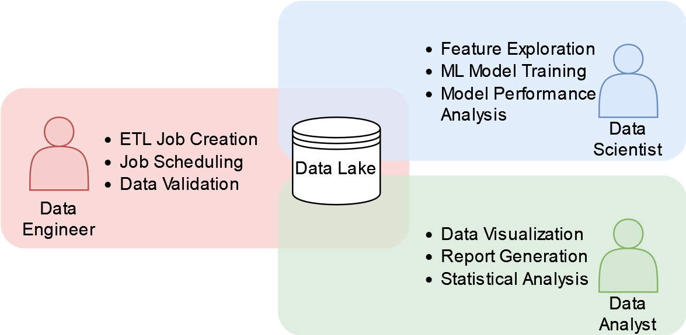
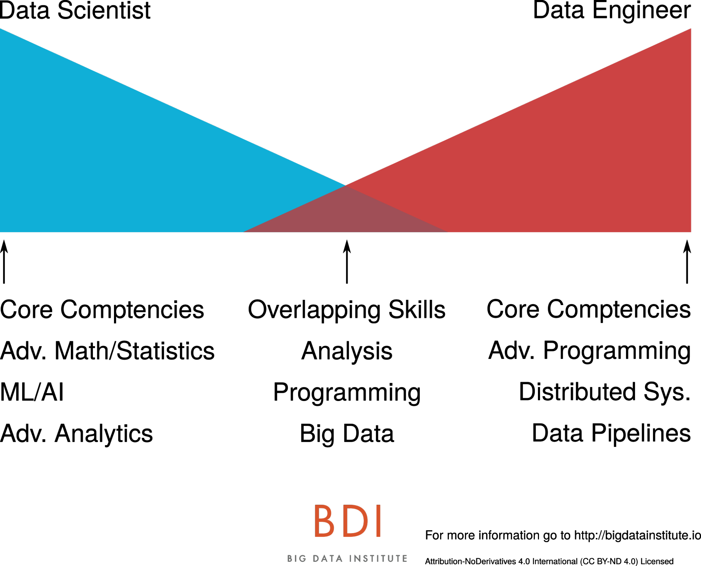
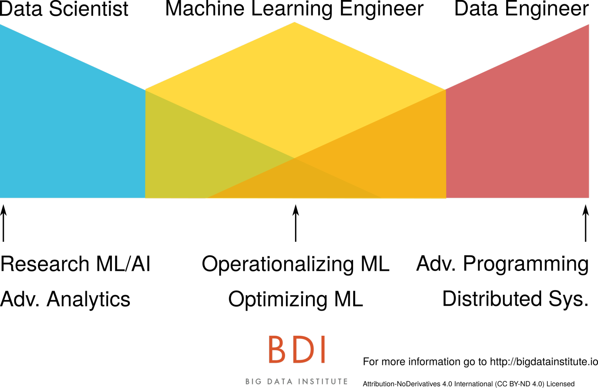
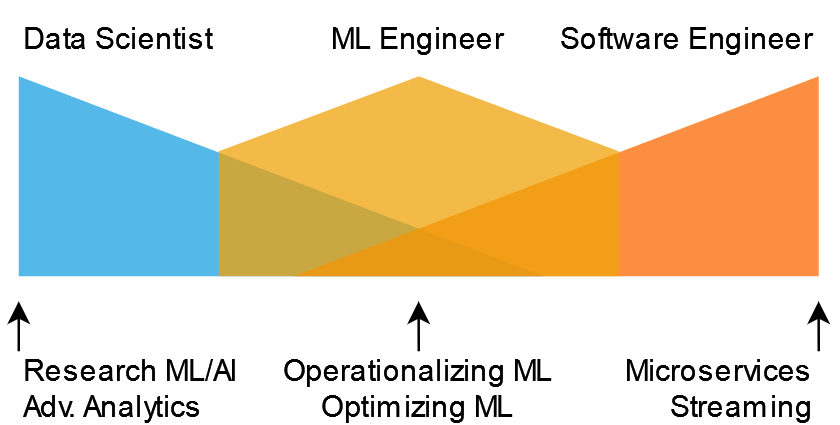
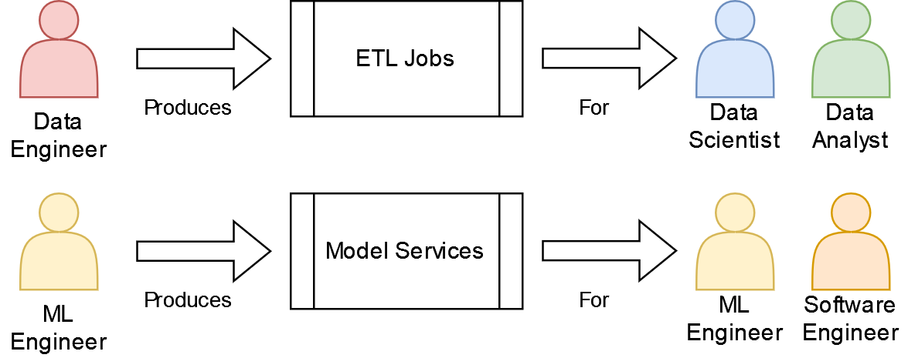

# Delve 4: The ML Engineer, Coming to an Enterprise Near You

> "Life is like riding a bicycle. To keep your balance, you must keep moving." - Albert Einstein

## Who am I?

Hello data delvers! I hope your year is off to a good start! For this delve I wanted to cover a question that I get asked often, especially whenever I meet someone new, the dialog usually goes something like this:

> Me: "Hi I'm Chase, nice to meet you!"
> 
> Other Person: "Hello Chase, it's nice to meet you too! I'm \<Insert Name Here\>. I'm a \<Insert Profession Here\>. What do you do for work?
>
> Me: "Oh! I'm a machine learning engineer!"
>
> Other Person: "Oh that's neat... What's a machine learning engineer?"

<!-- more -->

Ok, the conversations aren't usually that contrived and with the explosion in popularity of ChatGPT more and more people have heard the term machine learning than ever before but you understand the point. Those of you that have read the [about section](../about.md) of this blog will notice that (at the time of this writing) I call myself a *machine learning engineer*, but what does that profession actually entail? How does it differ from other professions in the data science and machine learning space such as *data engineer* or *data scientist*? Is it any different from a *software engineer*?  

In this delve, I intend to answer these questions and more by first providing a brief overview of the traditional roles in the "Big Data" space, introducing the emerging role of the machine learning engineer, and finally providing some commentary on how I think this specialization can most effectively be utilized within an enterprise.

## Traditional Roles in Big Data

When we think of the world of data science and machine learning, often referred to as "Big Data", historically three distinct roles emerge:

* Data Analyst
* Data Scientist
* Data Engineer

These roles have been the pillars on which many enterprises have built the foundation of their success in deriving value from their vast quantities of data. Understanding the responsibilities of these roles is crucial to leveraging them efficiently and effectively to drive business value. So what are they?

### Data Analyst

Arguably the profession that has been around the longest, *data analysts* specialize in collecting data from a wide variety of company sources and distilling it into reports, charts, and visualizations that stakeholders can use to inform business decisions.

Data analysts usually spend most of their time shifting through the enterprise's data lake and/or warehouse to answer a specific business question or provide an insight into a trend or pattern that is being observed in the business. 

The typical tools and technologies I have seen analysts rely on are data query languages like SQL or SAS, and data visualization suites such as PowerBI or Tableau.

The biggest strength of the business analyst is the ability to understand the context of a business problem and present just the right amount of data in order to solve it.

### Data Scientist

Deemed the "Sexist Job of the 21st Century" by the Harvard Business Review, *data scientists* use their advanced knowledge of statistics and machine learning to build and evaluate predictive models on data and solve complex problems.

Data scientists often spend much of their time in the same environments as data analysts, the data lake/warehouse. However, where the analysts focus on producing visualizations of the data, data scientists often focus on cleaning and organizing data to feed into their models. There's an often quoted statistic that "80% of a data scientists time is spent cleaning data". Due to the sensitivity of many modeling techniques to poor quality data, I can attest that this is indeed unfortunately often true. Once a cleaned collection of data has been produced, often called a *training set*, the data scientist will then use various machine learning techniques to attempt to build a model on that data which can be used to solve the business problem. Importantly, once a model has been trained, the data scientist will then evaluate that model with various statistical methods to ensure it is reasonably robust.

Tools and technologies data scientists use are programming languages such as R and Python along with the machine learning packages contained within them, big data processing frameworks such as Spark, and computation environments such as Jupyter notebooks (although if you've read my [previous delve](2023-12-10-production-notebooks.md), you may understand why this isn't the best idea).

The biggest strength of the data scientist is their advanced knowledge of machine learning that enables them to solve complex problems.

### Data Engineer

If you noticed, the last two roles depend on having all of the data available in a centralized location, often referred to as a data lake or warehouse. (Technically a lake and warehouse are not the same thing but the distinction is unimportant for this discussion.) It is the job of the *data engineer* to set up the pipelines to feed data into this centralized location.

Data engineers spend much of their time communicating with other engineering teams setting up ingestion processes for their data. Their primary function is to create ETL (Extract Transform Load) jobs to move and cleanse data between different systems. Often these jobs are run on a recurring cadence and take the form of python scripts, either within notebooks or plain files. 

Tools and technologies in this specialization include many of the same technologies data scientists use, Python and Spark, but the emphasis is on moving and transforming data rather than building ML models. In addition, job schedulers such as [Airflow](https://airflow.apache.org/) can be leveraged to manage ETL jobs. 

The data engineer's biggest strength is a deep technical understanding of how to process very large quantities of data at scale quickly and efficiently. 

## Traditional Enterprise Big Data Role Organization

Taking these roles, enterprises in my experience typically arrange them in the follow way:

*Figure 1: A Typical Enterprise Big Data Role Organization*

The centralized component is the data lake. Data engineers focus on hydrating the lake with the data required by the data scientists and analysts. The scientists and analysts in turn leverage the data to produce their work artifacts. This setup is extremely effective at producing models and reports that can be used to inform business decisions and deliver business value however there is a catch: What if instead of a data scientist or analyst communicating their results to a business stakeholder, we want the stakeholder to interact with the output of their work product directly, or even have an external customer interact with it? 

It is at this point this organization breaks down. How do we take an ML model and turn it into something that our front end applications can consume? What happens if we need the data in real time rather than in a batch ETL job that runs every 30 mins? How can we scale to have every one of our customers interacting with this model at the same time?

For those of you that have read some of my previous delves, this is what I call the "Production Problem". Suddenly an ad-hoc report is no longer enough, the model needs the support of engineers to deliver business value.

## The Production Challenge

The challenge at this point is that none of the roles in the traditional big data setup have the skills or experience to solve this dilemma. Where I've seen organization struggle is when they ask the data engineers, scientists, and analysts to solve this problem themselves. What ends up happening is that the individuals in these roles fall back on the technologies they are familiar with. Data engineers try to make ETL jobs run faster, data scientists string together notebooks in "pipelines" to generate the features the models need, analysts aren't really sure where they fit into a production system at all.

As a consequence, the resultant system usually turns out to be very expensive and inefficient to run if it works at all, the individuals that built it are frustrated being asked to deliver functionality they are not equipped to maintain, and the business value delivered suffers greatly as a result.

## Data Big and Small

When we think of training an ML model we often discuss the challenges of *Big* Data, of building ETL pipelines to move large batches of data between storage appliances to facilitate model training, however there is an equally challenging and often overlooked problem space of sending data to the model at inference time. Sometimes referred to as the *last mile* problem, this data is *Small* Data often individual samples of data, not the large batches of data the model was trained on. This challenge is often where I have seen enterprises tripped up. Why? Simply put, the tools, skills, and expertise to solve challenges in this space are completely different, they are much more akin to conventional software engineering challenge than big data ETL pipelines. 

What is needed is a new type of engineer, one which specializes in the *last mile* of getting ML models into a production environment.

## Enter the Machine Learning Engineer

The machine learning engineer, sometimes called an MLOps engineer, is the missing piece of this puzzle. Unlike data engineers, they are more familiar with conventional software engineering, and capable of turning analytic insights and models into services that can be consumed by the larger enterprise as well as having the ML knowledge and experience to interface with data scientists and understand the inference requirements of their models.

In one of my favorite articles on this subject, [Data Engineers vs. Data Scientists](https://www.oreilly.com/radar/data-engineers-vs-data-scientists/), author Jesse Anderson presents a juxtaposition between the skill sets of data scientists and engineers in the following graphic:

*Figure 2: Diagram illustrating the core competencies of data scientists and data engineers and their overlapping skills. Image Credit: Jessie Anderson*

He then presents the machine learning engineer as the middle ground between these two extremes:

*Figure 3: Diagram illustrating where a machine learning engineer fits with a data scientist and data engineer.  Image Credit: Jessie Anderson*

While I adore this visualization and agree with many of the points raised in the article, particularly about how to correctly staff resources surrounding ML (Business leaders: Don't hire a bunch of data scientists and expect "magic" to happen without engineering support!), when I think about my own career as someone who calls themselves a machine learning engineer this narrative of the data engineer who cross trains on data science side to end up as a hybrid between the two roles doesn't particularly resonate with me. While it is tantalizingly elegant to place the machine learning engineer between a data scientist and data engineer I have found that the types of problems I tend to work on and solve day to day have much more in common with conventional software engineering than those I typically see data engineers work on, with some additional data science complexity added on top.

If I adopt the same overlapping skill diagram I find the following to be a much better representation of the type of work I do:

*Figure 4: Diagram illustrating where a machine learning engineer fits with a data scientist and software engineer.*

## A Software Engineer with Data Science Know-How

When I think about the types of problems that I solve as an ML engineer they are usually formulated as something like this:

*In response to an event (http request, or streaming event), fetch some data and send it to a model for inference and publish the result (either as an http response, or to a downstream event consumer).*

A more concrete example might look something like this:

*When the customer logs into our system (the event), grab their profile (the data), and display a personalized welcome message from our model on their homepage (the result).*

If you think to yourself, "Hey that sounds like something a typical microservice architecture could solve!" you'd be right! As mentioned previously, the scale of the data needed at model inference time is typically not the scale of data at the time the model was trained. It's single samples at a time not the large batches of data the model was trained on. It is true that there are production use cases for batch inference, but in my experience it's almost always better to go with a streaming-based approach as you can fairly easily process records in batch through a streaming system (by batching the event consumer) but the inverse is not true.

The Machine Learning Engineer is the specialist in this sphere. They have the software engineering chops to build scalable and sustainable microservice architectures to deploy ML models as capabilities other engineering teams can leverage. They also have the Data Science know-how to interface with the data scientists, understand their requirements, and help develop the model training code into an engineering artifact. 

Another way to look at the difference between an ML Engineer and a Data Engineer is what their work product is and who consumes it:

 * A *Data Engineer* produces *ETL Pipelines* the output of which is consumed by *Data Scientists and Data Analysts*
 * A *ML Engineer* produces *Models as a Service* the output of which is consumed by *Other Engineering Teams*

*Figure 5: Diagram illustrating the differences in work product and consumers between Data Engineers and ML Engineers*

As you can see illustrated above, based on the who the end consumer of their work product is, it makes sense that data engineers and ml engineers would have different skill sets and strengths. The real value-add of the ML engineer is the ability to take the output of the data scientist (models) and turn it into a *product*, that is a service that *other* engineering teams can consume. Many ML engineers also have the data science know-how to build ML models themselves, which presents an opportunity for a shift within the industry.

## The Future of ML Engineers and "MLOps"

With the barrier to entry for building ML models continuing to become lower, the task of training a model that once took a highly specialized data scientist months of effort complete is often now being reduced to a matter of calling `model.fit()` in whatever ML library of choice you'd like to use. Even the highly complex Large Language Models (LLMs) that have taken the world by storm over the past year are often being exposed behind [convenient APIs that any ML engineer should be able to reasonably utilize](https://openai.com/blog/openai-api) (creating a whole sub domain of MLOps know as LLMOps). This poses the question then, instead of having a data scientist spend much time and effort producing a model in the form of a Jupyter notebook and then have the ML engineer translate it into "production", wouldn't it be more efficient to have the ML engineer write the code from the start?

It is this thought that I have seen slowly shift the approach enterprises' take in staffing their data science and ML departments. The days of the data scientist producing notebooks and tossing them over the wall to engineering are coming to an end. While there will continue to be a place for data scientists doing experimentation and research within the enterprise, there will be fewer of them, with more of the burden of training and deploying models shifting to ML engineers. As such, I expect the demand for ML engineers to continue to increase in the coming years, and be accelerated by the LLM boom under the banner of the LLM engineer. What does this mean if you are in one of the other roles in the "Big Data" space?

If you are a data scientist or data engineer it means you should start learning more conventional software engineering practices. If you are data analyst, learn to start leveraging the output of the ML services created by ML engineers as part of your analysis and A/B testing. Though cliche, it is true that the only constant in this industry is change and if they last year has taught us anything, it's that change is only happening faster than ever before.

## Additional Reading

* [Data Engineers vs Data Scientists](https://www.oreilly.com/radar/data-engineers-vs-data-scientists/) - The previously mentioned article by Jessie Anderson that introduces the concept of the ML engineer and where they fit in a business organization
* [What is a Machine Learning Engineer?](https://towardsdatascience.com/what-is-a-machine-learning-engineer-597ff778e57b) - Principal ML Engineer David Hundley provides his perspective on what the role is
* [[D] Is Data Science Dead?](https://www.reddit.com/r/MachineLearning/comments/1acmnhk/d_is_data_science_dead/) A discussion thread on `r/datascience` regarding the future of data science as a career path and the industry trend of shifting towards ML engineering

## Delve Data

* Historically the three major roles in big data have been Data Analysts, Data Engineers, and Data Scientists
* In the last few years a new role, ML Engineer, has emerged specializing in turning ML models into products
* ML Engineers have the potential to take over much of the work of data scientists while reducing the burden of translating notebook code into production applications