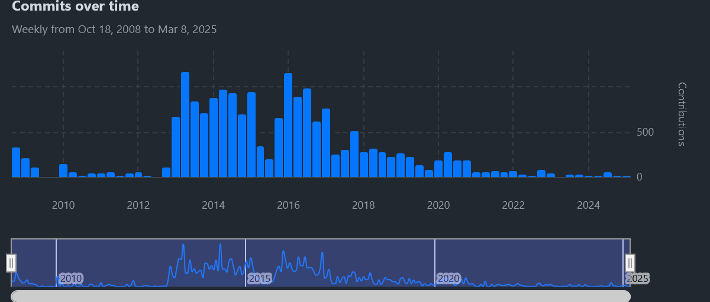
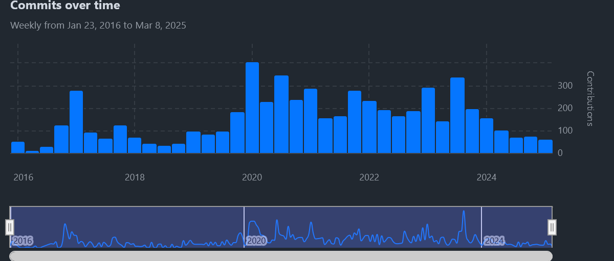

# Delve 9: Migrating from Jekyll to MkDocs


> "Good tools make good work." - Unknown

## From one Static Site to Another

Greetings data delvers! The sharper-eyed among you may have noticed that the website looks a little bit different now. No you aren't seeing things. I recently completely changed the backend of the site from [Jekyll](https://jekyllrb.com/) to [Material for MkDocs](https://squidfunk.github.io/mkdocs-material/). The process was overall pretty smooth but had some hiccups which I think are worth documenting. However, before we get into that, why the change in the first place?

<!-- more -->

## Jekyll, where all the complexity Hydes

The Jekyll project has been around for quite some time (it was originally released in 2008!), and during that time it became the most popular static site generator out there. However, much like its namesake Dr. Jekyll it has developed an ugly side. Jekyll comes from a time when Ruby on Rails ruled the web, however according to the most recent [Stack Overflow Developer Survey](https://survey.stackoverflow.co/2024/technology#most-popular-technologies-language-prof) only 5.2% of respondents use Ruby, compared to languages like Python or Javascript which both are over 50% usage.

We can see this stagnation if we look at commits to the Jekyll project as well on Github:

*Figure 1: Jekyll Commits over Time*



We can see that commits peaked around 2016 and then declined to the point where there are hardly any at all. The last major release of the project was over a year ago and it has only received minor updates since then. Despite this Jekyll is still the [recommended static site generator for GitHub Pages](https://docs.github.com/en/pages/setting-up-a-github-pages-site-with-jekyll/about-github-pages-and-jekyll) which is why a built the site using it in the first place. This in it of itself would not be an issue if the project was stable, however there have been several occasions where the build of this blog would break due to some Ruby dependency requiring debugging just to publish my latest article, not great.  In addition, as someone who has never really professionally worked with Ruby, the unfamiliar toolchain also made extending the framework to add additional functionality difficult, leading to my interest in finding an alternative static site engine. 

## Material for MkDocs, Made of the Right Stuff

My inspiration for migrating came when I was browsing some of the articles in my favorite Python newsletter [PyCoders Weekly](https://pycoders.com/) and came across [one that was using a slick UI](https://blog.jonathanchun.com/2025/02/16/to-type-or-not-to-type/) (It's a good read by the way). At the bottom of the article was a link stating "Made with Material for MkDocs". Following the link brought me to the [Material for MkDocs](https://squidfunk.github.io/mkdocs-material/) project and I was instantly impressed with what they had put together. It builds on top of the already popular [MkDocs](https://www.mkdocs.org/) project to provide a clean, modern theme inspired by material design principles. In addition, unlike Jekyll is has pretty active development community and is used by some pretty popular projects we've used on this blog to generate their websites like [uv](https://docs.astral.sh/uv/) and [FastAPI](https://fastapi.tiangolo.com/).

*Figure 2: Material for MkDocs Commits over Time*



Finally, it uses Python as it's backend which means it's much easier for me to extend and work with. All of these reasons led me to decide to take the plunge and migrate.

## Migrating from Jekyll to Material

To kick things off I started by reading the [Setting up a blog](https://squidfunk.github.io/mkdocs-material/setup/setting-up-a-blog/) documentation on the Material website. This is a good starting point but as I came to learn, it simplifies some things so it's not an end-all-be-all resource. Fundamentally, both Jekyll and Material use Markdown documents to provide the content for the generated pages, so with some minor adjustments to our folder structure we can get the content of the site to render. This involved migrating to the following directory structure:

```
├── README.md
├── docs
│   ├── CNAME
│   ├── about.md
│   ├── assets
│   ├── index.md
│   └── posts
├── mkdocs.yml
├── pyproject.toml
└── uv.lock
```

!!! note
    For my site which is primarily a blog I followed this [blog only](https://squidfunk.github.io/mkdocs-material/setup/setting-up-a-blog/#blog-only) section of the setup guide to have all of my posts directly under the `docs/posts` path.


Some other nice things here is since Material is a Python package we can use [uv](https://docs.astral.sh/uv/) and a `pyproject.toml` file to manage our dependencies!

The next step was to clean up the Markdown of the posts themselves. An example of the Markdown of my very first post looked something like this:

```markdown
---
layout: post
title:  "Delve 0: Hello Labyrinth (World)!"
author: Chase
categories: Meta
top: 1
banner: 
    image: "/assets/images/banners/delve0.png"
---

> It seemed so daunting, "I need to make this model work!", "Running this in a notebook isn't good enough, we need to drive live site traffic against this!", "All of this data is bad!".

## Entering the Labyrinth

Welcome to my blog data delver! I'm so glad you found your way here!  If you're like me, when you first started out with data science and machine learning, you may have been feeling overwhelmed. With so many different concepts to learn it may have seemed as if there was an insurmountable labyrinth of information ahead of you, with no clear path towards mastery and practical application.  Fear not! For you have found a resource which shall aid you in your own quest to navigate the maze.

### Purpose of this Blog

The purpose of this blog is to document my own "delves" into this labyrinth and any resulting knowledge I have unearthed. I plan to focus on a range of topics, from general software engineering to data science, machine learning engineering, and MLOps, pulling from a range of experiences across my own career as a machine learning engineer and data scientist with a focus on practical, grounded application in industry following best practice.

### Who am I?

My name is Chase Greco, I'm currently a machine learning engineer with 5+ years of industry experience. I love exploring all things machine learning with a particular emphasis on practical application and "making things real". When I'm not writing code, I enjoy swing dancing, reading, and playing video games.

## Delve Data
* Welcome to my blog!
* Stay tuned for more posts on data science, machine learning, and MLOps!
```

This needed to be slightly modified like so:

```markdown
---
date: 2023-11-06
categories: 
    - Meta
---

# Delve 0: Hello Labyrinth (World)!


> It seemed so daunting, "I need to make this model work!", "Running this in a notebook isn't good enough, we need to drive live site traffic against this!", "All of this data is bad!".

## Entering the Labyrinth

Welcome to my blog data delver! I'm so glad you found your way here!  If you're like me, when you first started out with data science and machine learning, you may have been feeling overwhelmed. With so many different concepts to learn it may have seemed as if there was an insurmountable labyrinth of information ahead of you, with no clear path towards mastery and practical application.  Fear not! For you have found a resource which shall aid you in your own quest to navigate the maze.

<!-- more -->

### Purpose of this Blog

The purpose of this blog is to document my own "delves" into this labyrinth and any resulting knowledge I have unearthed. I plan to focus on a range of topics, from general software engineering to data science, machine learning engineering, and MLOps, pulling from a range of experiences across my own career as a machine learning engineer and data scientist with a focus on practical, grounded application in industry following best practice.

### Who am I?

My name is Chase Greco, I'm currently a machine learning engineer with 5+ years of industry experience. I love exploring all things machine learning with a particular emphasis on practical application and "making things real". When I'm not writing code, I enjoy swing dancing, reading, and playing video games.

## Delve Data
* Welcome to my blog!
* Stay tuned for more posts on data science, machine learning, and MLOps!
```

A few things to point out:

* The post metadata is much more simplified
* An explicit date now needs to be added to the metadata
* `categories` metadata now needs to be represented as a list
* The `title` and `banner` needed to be moved to the main body of the post
* A `<!-- more -->` comment needed to be added to facilitate marking a cutoff for the post excerpt  

## Delve Data

* Breaking our application into three layers *Data*, *Business Logic*, and *Interface* allows us to separate concerns within our codebase and make it more flexible and robust. 
