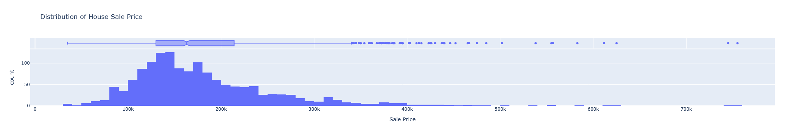
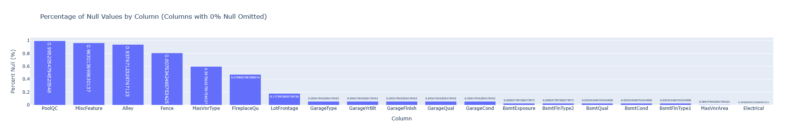

# Delve 13: Let's Build a Modern ML Microservice Application - Part 7, Model Tracking and APIs with MLFlow


> "Machine learning models are only as good as their deployment strategy. An unused model is just a fancy equation." - Chat GPT

## Reset and Rescope

Hello data delvers! In [part six](2025-05-04-ml-micro-part-six.md) of this series we containerized our application, making it portable and easy to deploy. For this part we will take a step back. Introduce machine learning (finally!), and explore how we can begin to incorporate machine learning models into our microservice ecosystem!   
<!-- more -->

## Machine Learning (Finally!)

This series has up until now focused on *core software engineering knowledge*. This is intentional, if you've read [some of my previous delves](2024-04-27-ml-engineer.md), you'll know that I view machine learning grounded in good software engineering practices as essential to extract business value at scale. It is for this reason I wanted to ensure we had laid a sturdy foundation in engineering before introducing the science, but without further ado, let's dive in!

This series will not focus on machine learning fundamentals as there are [plenty of good resources out there already that already cover that](2023-12-23-ml-resources.md), however what I will touch on is how to develop machine learning models with an engineering mindset. To begin, go ahead and create an account on [kaggle](https://www.kaggle.com/). Kaggle is ubiquitous in the data science world as a place to host competitive data science competitions (like the famous [Zillow Prize](https://www.kaggle.com/c/zillow-prize-1)), but it is also an invaluable resource to learn from. For this delve we will be working with the dataset provided by the [House Prices - Advanced Regression Techniques](https://www.kaggle.com/competitions/house-prices-advanced-regression-techniques) learning competition so go ahead an sign up to it with your kaggle account and take a quick look at the data it provides as well as some of the submissions others have made to the competition to get a feel for what is working. 

## Prepare Your Project

Instead of building off our existing codebase we are going to start fresh with a brand new project (don't worry we'll be revisiting our previous codebase in a future delve!). Go ahead and initialize a starter project with `uv init` that will give you a basic file structure that looks something like this:

``` title="uv Starter Project Structure"
├── .git
├── .gitignore
├── .python-version
├── README.md
├── hello.py
└── pyproject.toml
```

You can go ahead a remove the `hello.py` script, we won't be using it. Now, our future project will have multiple different parts. Such as for *training* the model, and *using* the model as part of microservices. As you can probably imagine, the set of Python library dependencies we have for training the model may be different than the Python library dependencies we have when we use the model. However, any libraries we have in common throughout the different parts of the project we probably want to stay the same version.  Previously this was a big headache, we could have different `requirements.txt` files for the different project parts to maintain different sets of dependencies, but making sure that if a dependency was re-used in multiple parts it was the same version? Good luck! Fortunately for us `uv` comes to the rescue here with its concept of [workspaces](https://docs.astral.sh/uv/concepts/projects/workspaces/). We can have a single uv workspace with one `uv.lock` file but multiple different sub-applications within it with their own dependency lists.

Let's try it out! Go ahead and create a `housing-price-model` directory to hold our model application. Within it create a new `pyproject.toml` file with the following contents:

```toml title="housing-price-model/pyproject.toml" linenums="1"
[project]
name = "housing-price-model"
version = "0.1.0"
description = "Example repository of how to build a price regression model."
readme = "README.md"
requires-python = ">=3.13"
```

The final trick to make this work is we have to modify the root `pyproject.toml` file to let uv know about this workspace member:

```toml title="pyproject.toml" linenums="1" hl_lines="9-10"
[project]
name = "modern-ml-microservices"
version = "0.1.0"
description = "Example repository of how to build a modern microservice architecture to support machine learning applications."
readme = "README.md"
requires-python = ">=3.13"
dependencies = []

[tool.uv.workspace]
members = ["housing-price-model"]
```

You can also add a project description too if you'd like. We should now have a project directory structure that looks like so:

``` title="Project Structure with uv Workspace"
├── .git
├── .gitignore
├── .python-version
├── README.md
├── housing-price-model
│   └── pyproject.toml
└── pyproject.toml
```

Next up within the `housing-price-model` directory create a sub-directory called `data` and place the dataset files from kaggle within it.

!!! tip
    It's a good idea to add your `data` directory to your `.gitignore` so the data files don't get checked into github. Not only is it [against the rules of the competition to do so](https://www.kaggle.com/competitions/house-prices-advanced-regression-techniques/rules), it's generally bad practice to version data files with git, there are better tools we will cover in the future for that. 🙂

Finally, create a another sub-directory called `notebooks` with the `housing-price-model` directory to hold our Jupyter notebooks for modeling. "Jupyter notebooks!?!? I though we weren't supposed to use those?" I might hear you say, and based on my [previous delve](2023-12-10-production-notebooks.md) you wouldn't be wrong in asking the question, however in this case I think Jupyter notebooks are useful for a few reasons:

* We are in the early phase of exploring the data and the problem and in this state the visual nature of the notebooks can be useful
* Notebooks are extremely useful when trying to teach or explain a concept, which is what I'm trying to do in this delve
* We'll be converting the model training code out of notebooks in a future delve 😉

With that we should have our final project directory structure that looks like this:

``` title="Full Project Structure"
├── .git
├── .gitignore
├── .python-version
├── README.md
├── hello.py
├── housing-price-model
│   ├── data
│   │   ├── data_description.txt
│   │   ├── sample_submission.csv
│   │   ├── test.csv
│   │   └── train.csv
│   ├── notebooks
│   └── pyproject.toml
└── pyproject.toml
```

## Build a Model

To start off with we need to install our project dependencies. First off make sure you are in the `housing-price-model` directory in your shell, then you can use `uv add` to install all of these dependencies:

* [pandas](https://pandas.pydata.org/) - Standard library for data manipulation
* [scikit-learn](https://scikit-learn.org/stable/) - The most popular library for doing machine learning in Python
* [plotly](https://plotly.com/) - My preferred library for generating data visualizations (there a much better options out there than matplotlib!)

Also, depending on what environment you want to run your notebooks in there are some optional dependencies as well:

* [jupyterlab](https://jupyter.org/) - The standard web-based notebook interface available from jupyter
* [anywidget](https://anywidget.dev/en/getting-started/) - An extension for jupyter that enables interactive plots

!!! note
    I will be using jupyter lab as my notebook execution environment however you can also run notebooks [directly in VSCode](https://code.visualstudio.com/docs/datascience/jupyter-notebooks).

Within the `housing-price-model` directory go ahead an fire up JupyterLab by executing `jupyter lab` in your shell. Within the `notebooks` folder create a new notebook called `train_model.ipynb`.

!!! tip
    If you've never used JupyterLab before you can check out their getting started docs [here](https://jupyterlab.readthedocs.io/en/latest/getting_started/overview.html)!

To start off create a new cell to import our dependencies:

```python title="Cell 1" linenums="1"
import pandas as pd
import numpy as np

from sklearn.model_selection import train_test_split
from sklearn.metrics import mean_squared_error, mean_absolute_error
from sklearn.ensemble import RandomForestRegressor
from sklearn.pipeline import Pipeline
from sklearn.impute import SimpleImputer
from sklearn.compose import ColumnTransformer
from sklearn.preprocessing import OneHotEncoder

import plotly.express as px
```

!!! note
    If you'd rather follow along with a completed notebook you can do so [here](https://github.com/DataDelver/modern-ml-microservices/blob/part-seven/housing-price-model/notebooks/train_model.ipynb)!

It's best practice to import all of your libraries at the top of your notebook just like a regular Python script rather than throughout the notebook itself. This way you can quickly tell at a glace the dependencies of the notebook.

Next off we can load our dataset into memory using pandas:

```python title="Cell 2" linenums="1"
# Load Dataset

# Load training and test datasets
train = pd.read_csv('../data/train.csv')
test = pd.read_csv('../data/test.csv')

# Display shapes
print(f"Train Shape: {train.shape}")
print(f"Test Shape: {test.shape}")

# Preview the data
train.head()
```

We can take note out test data has one less column then our training data (this makes sense since it doesn't have an actual price for each house).

If we want to visualize our target variable (Sale Price) we can do so using Plotly like so:

```python title="Cell 3" linenums="1"
# Create a histogram chart using Plotly
fig = px.histogram(
    train, 
    x='SalePrice',
    labels= {'SalePrice': 'Sale Price'},
    title='Distribution of House Sale Price',
    marginal='box'
)
fig.show()
```

This will give you a visualization that looks something like this:



!!! note
    While the image above is a static png file, the true power of Plotly is that it is interactive! Try out the code within the notebook and hover your mouse over the graph, it will give you more details!

In a similar way, we can use plotly to visualize the percentage of null values in each column to identify any columns that are mostly null (it's usually good practice to drop columns that are mostly null as they won't provided much information to the model).

```python title="Cell 4" linenums="1"
# Calculate percentage of null values for each column
null_percentages = train.isnull().mean()
null_percentages = null_percentages.reset_index()
null_percentages.columns = ['column', 'percent_null']
null_percentages = null_percentages[null_percentages.percent_null > 0]
null_percentages.sort_values(by='percent_null', inplace=True, ascending=False)

# Create a bar chart using Plotly
fig = px.bar(
    null_percentages,
    x='column',
    y='percent_null',
    title='Percentage of Null Values by Column (Columns with 0% Null Omitted)',
    labels={'percent_null': 'Percent Null (%)', 'column': 'Column'},
    text='percent_null'
)

fig.show()
```

This will give you the following plot:



We can then drop columns with a high percentage of nulls using pandas:

```python title="Cell 5" linenums="1"
# Drop columns with more than 30% missing values
drop_cols = null_percentages[null_percentages.percent_null > 0.3].column
train_df = train.drop(columns=drop_cols)
```

We do a final bit of cleaning with pandas and form our feature and target columns:

```python title="Cell 6" linenums="1"
# Remove ID column as it won't be used for training
train_df.drop(columns=['Id'], axis=1, inplace=True)

# Define features and target
X = train_df.drop(['SalePrice'], axis=1)
y = train_df['SalePrice']
```

Next we do a pretty standard train test split using scikit-learn:

```python title="Cell 7" linenums="1"
# Train-Test Split
X_train, X_val, y_train, y_val = train_test_split(X, y, test_size=0.2, random_state=42)
```

We round out our data exploration with identifying the type of data in each column (namely whether they are [categorical](https://en.wikipedia.org/wiki/Categorical_variable) or [numeric](https://en.wikipedia.org/wiki/Continuous_or_discrete_variable)):

```python title="Cell 8" linenums="1"
numeric_columns = X_train.select_dtypes(include=['int64', 'float64']).columns
categorical_columns = X_train.select_dtypes(include=['object']).columns

print(f'Numeric columns: {numeric_columns}')
print(f'Categorical columns: {categorical_columns}')
```

## Feature Engineering

The next part of our notebook will focus on feature engineering. It is also where I want to spend a decent amount of time. Feature engineering is in my experience often where the breakdown between Data Scientists and ML Engineers occurs. I think a large part of this is due to how feature engineering is typically presented in tutorials (and indeed many of the notebooks submitted to this competition). It is usually viewed as a separate stage of the pipeline *distinct* from the model itself. In such cases you will typically see pandas being used (the ubiquitous `pd.get_dummies()` for encoding categorical variables for example) to transform the dataset into the features the model utilizes. This creates two issues:

1. Since feature engineering can be any arbitrary python code it can become very complex and very messy
2. Any feature engineering that is performed will have to be replicated in the environment where the model is used to make predictions

These issues combine to create situations where engineers must translate and replicate feature engineering logic from notebooks to their production serving environments. As I've discussed in previous delves, this process is prone to error and can create a lot of friction. However, there is a better way, and we already have all the tools to do it!

Instead of treating the feature engineering logic as a separate component, we could bundle it with the model itself. We'd have to set some constraints on what feature transformations could be performed (they couldn't call out to external APIs for example), but then we wouldn't have to worry about replicating any feature engineering logic as it would be a part of the model!

scikit-learn actually supports this concept through the use of [Column Transformers & Pipelines](https://scikit-learn.org/stable/auto_examples/compose/plot_column_transformer_mixed_types.html), though it is sadly not widely publicized. For example if we wanted to replace all values missing from numeric columns with their median, and all categorical values with their most frequent value we could do the following transformation in pandas:

```python title="Hypothetical Feature Engineering" linenums="1"
# Fill numeric columns with median
num_cols = df.select_dtypes(include=['int64', 'float64']).columns
for col in num_cols:
    df[col] = df[col].fillna(df[col].median())

# Fill categorical columns with most frequent value
df = df.fillna(df.mode().iloc[0])
```

However, now in order to use our model this logic will have to be run *somewhere* on the data before it is sent to the model (usually in a different layer of the application), hence an opportunity for breaking or mis-translation. This issue compounds if you are trying to test different versions of the model. What if one model version uses the median to impute missing numeric values, but another version of the model uses the mean. How do you ensure the right feature engineering logic is being applied to the right version of the model? The answer: You can't.

Instead of doing it this way though we could take advantage of the column transformers to define the logic in a bit more constrained way:

```python title="Cell 9" linenums="1"
impute_transformer = ColumnTransformer(
    [
        (
            'median_imputer', 
            SimpleImputer(missing_values=np.nan, strategy='median'),
            numeric_columns
        ),
        (
            'mode_imputer',
            SimpleImputer(missing_values=np.nan, strategy='most_frequent'),
            categorical_columns
        )
    ],
    remainder='drop',
    verbose_feature_names_out=False
)
```

The `ColumnTransformer` takes in a list of tuples where the first value is a name for the transformation, the second value is a function conforming to the scikit-learn transformer signature, and the third value is a list of columns to apply the transformation on. Hopefully you can already see how this is much more structured and uniform compared to the previous code. Now you might say "That's great if I want to do a transformation built into scikit-learn, but what if it doesn't have the functionality I need?". Fortunately, scikit-learn supports creating your own transformer functions pretty easily with the [FunctionTransformer](https://scikit-learn.org/1.6/modules/generated/sklearn.preprocessing.FunctionTransformer.html) or your own transformer class by inheriting from [TransformerMixin](https://scikit-learn.org/stable/modules/generated/sklearn.base.TransformerMixin.html) so you aren't really giving up any functionality, just obeying a common signature.

We can apply [one-hot encoding](https://en.wikipedia.org/wiki/One-hot) to our categorical features in a similar way:

```python title="Cell 10" linenums="1"
encode_transformer = ColumnTransformer(
    [
        (
            'categorical_one_hot', 
            OneHotEncoder(sparse_output=False, handle_unknown='ignore'),
            categorical_columns
        )
    ],
    remainder='passthrough',
    verbose_feature_names_out=False
)
```

!!! Note
    I go into a bit more depth on what these transformations are actually doing in the [companion notebook](https://github.com/DataDelver/modern-ml-microservices/blob/part-seven/housing-price-model/notebooks/train_model.ipynb) so be sure to check it out!

Create our model:

```python title="Cell 11" linenums="1"
model = RandomForestRegressor(n_estimators=100, random_state=42)
```

And *attach* the transformations to the model by creating a `Pipeline`:

```python title="Cell 12" linenums="1"
pipeline = Pipeline(
    [
        ('impute', impute_transformer),
        ('encode', encode_transformer),
        ('model', model)
    ]
).set_output(transform='pandas')
pipeline
```

This will also display a [visualization of the pipeline](https://scikit-learn.org/stable/auto_examples/miscellaneous/plot_pipeline_display.html) in the notebook output!

Now we can train our model with the feature engineering attached:

```python title="Cell 13" linenums="1"
pipeline.fit(X_train, y_train)
```

And make predictions on the test set with:

```python title="Cell 14" linenums="1"
pipeline.predict(test)
```

Notice how we didn't have to transform our data at all before we fed it into the model for predictions? That's the power of attaching our feature engineering directly to the model! Now some poor engineer doesn't have to replicate that logic anywhere and if we wanted to test different versions of the model with different feature engineering logic? No sweat, each version has the correct logic attached to it already. This simple approach of attaching feature engineering logic to models can dramatically reduce friction when deploying them and speed up time to production.

!!! tip
    As with any software pattern, bundling feature engineering logic with the model has potential to be misused. (I've seen whole A/B tests orchestrated within bundled feature engineering logic for example). When deciding what logic to bundle with the model a good rule of thumb is if it specific to the training set the model was built on (a median value changes based on the samples in the training set for example) consider bundling it with the model. If the transformation is not related to the training set (choosing which version of the model to use for which customers for example) don't bundle it. This rule can be broken however if computing the feature on-the-fly as data is sent to the model is computationally expensive. As with all things, a balance must be found between convenience and computational practicality.

## Get in the Flow with MLFlow

As with all science, the key to success is experimentation. We rarely get it right the first try, we have to try different algorithms and parameters to see what works and what doesn't for the problem we are trying to solve, [there is no free lunch](https://en.wikipedia.org/wiki/No_free_lunch_theorem). Therefore, keeping track of our experiments is of paramount importance and that's where another tool, [MLFlow](https://mlflow.org/), is particularly helpful. Backed by the same company that created Databricks, MLFlow is an all in one solution for experiment tracking and reporting, model versioning, and more. We can install it by running `uv add mlflow` in the root of our project.

MLFlow follows a centralized server paradigm but for example purposes we can run the server locally. Create a new directory in the project root called `mlflow-server` and inside an executable bash script with the following contents:

```bash title="mlflow-server/start-mlflow.sh" linenums="1"
#! /usr/bin/env bash

# This script starts the MLflow server on localhost:9999
# Ensure the script is run from the directory where it is located
# Usage: ./start-mlflow.sh

# Check if MLflow is installed
if ! command -v mlflow &> /dev/null
then
    echo "MLflow could not be found. Please install it first."
    exit 1
fi

cd $(dirname "$0")
mlflow server --host 127.0.0.1 --port 9999
```

Go ahead execute the script to start MLFlow and check out the server UI, there won't be a whole lot here yet! 

!!! tip
    MLFlow will create two directories `mlartifacts` and `mlruns` when it executes. You can choose to add these to the .gitignore so they don't get checked in (and you probably should in production settings) but it means your trained model artifacts will *not* be checked into git.

Next we are going to be modifying our notebook to utilize MLFlow. Since MLFlow is a dependency of modeling, we can add it to the `housing-price-model` application by running `uv add mlflow` in the `housing-price-model` directory as well (importantly the same version of MLFlow will be used).

First we have to import MLFlow:

```python title="Cell 1 (Modified)" linenums="1" hl_lines="14-15"
import pandas as pd
import numpy as np

from sklearn.model_selection import train_test_split
from sklearn.metrics import mean_squared_error, mean_absolute_error
from sklearn.ensemble import RandomForestRegressor
from sklearn.pipeline import Pipeline
from sklearn.impute import SimpleImputer
from sklearn.compose import ColumnTransformer
from sklearn.preprocessing import OneHotEncoder

import plotly.express as px

import mlflow
from mlflow.models import infer_signature
```

We also have to tell MLFlow where the server is running:

```python title="Cell 13 (Modified)" linenums="1"
# Create a new MLflow Experiment
mlflow.set_tracking_uri(uri='http://127.0.0.1:9999')
mlflow.set_experiment('Housing Price Prediction')
```

Next we modify our training code to run under an MLFlow experiment and log the trained model along with some metrics using MLFlow:

```python title="Cell 14 (Modified)" linenums="1"
# Create a new MLflow Experiment
# Start an MLflow run
with mlflow.start_run():
    pipeline.fit(X_train, y_train)
    
    y_pred = pipeline.predict(X_val)
    
    rmse = np.sqrt(mean_squared_error(y_val, y_pred))
    mae = mean_absolute_error(y_val, y_pred)
    fig = px.scatter(
        x=y_val, 
        y=y_pred, 
        labels={
            'x': 'Actual House Sale Price',
            'y': 'Predicted House Sale Price'
        },
        title='Actual vs Predicted House Sale Price'
    )

    # Log metrics and figures
    mlflow.log_metric('RMSE', rmse)
    mlflow.log_metric('MAE', mae)
    mlflow.log_figure(fig, 'actual_vs_predicted.html')

    # Infer the model signature
    signature = infer_signature(train[X_train.columns], y_pred)
    
    # Log the model
    model_info = mlflow.sklearn.log_model(
        sk_model=pipeline,
        artifact_path='model',
        signature=signature,
        input_example=X_train
    )
    
print("Random Forest RMSE:", rmse)
print("Random Forest MAE:", mae)
```

A few thing to note here:

* The model training code is run under a `with mlflow.start_run():` clause, this tells MLFlow this code will be a new `run` under the experiment.
* Model metrics and figures can be logged along with the model using the `log_metric()` and `log_figures()` functions respectively
* `infer_signature` can be used to auto-infer a model data contract from the training data
* The model artifact itself is logged with `log_model()`

!!! tip
    If you read the MLFlow documentation you may come across the [autolog](https://mlflow.org/docs/latest/tracking/autolog/) feature. I've always found this feature to be buggy and unrealiable so I prefer to log experiment artifacts explicitly.

Go ahead and run the above code an check out the MLFlow UI. You should see a *Housing Price Prediction* experiment available with the *run* under it (usually with a cute autogenerated name). If you click around you should be able to view the logged metrics and figures as well as the model artifact itself. Subsequent runs will also be available here (provided the are run under the same experiment name), allowing you to easily compare different versions of the model and importantly have a record (ideally backed up on an external server) of all variations trained!

!!! tip
    I'm just scratching the surface of MLFlow functionality, I encourage you to check out the [MLFlow Docs](https://mlflow.org/docs/latest/) to see all of the functionality available!

## Create an API

With our model tracked in MLFlow believe it or not we have all we need to turn it into an API. One of the benefits of MLFlow is it comes with a [serving layer](https://mlflow.org/docs/latest/deployment/) that can host any MLFlow model as an API within a Docker container!

To take advantage of this we can create a new sub-directory under `housing-price-model` called `deployment` with the following `model-build.sh` script:

```bash title="housing-price-model/deployment/model-build.sh" linenums="1"
#! /usr/bin/env bash

# This script builds a Docker image for an MLflow model using the specified model URI.
# It uses the MLflow CLI to create the Docker image and enables MLServer for serving the model.
# Usage: ./model-docker-build.sh <model_uri> <image_tag>

# Ensure that MLflow is installed and available in your environment.
# Make sure to replace the model URI with your actual model URI if needed.
# Example model URI: runs:/<run_id>/model

# Check if MLflow is installed
if ! command -v mlflow &> /dev/null
then
    echo "MLflow could not be found. Please install it first."
    exit 1
fi

# Generate the Docker File for the Model
cd $(dirname "$0")/.. || exit 1
mlflow models generate-dockerfile --model-uri $1 --output-directory build --enable-mlserver

# Build the Docker image for the MLflow model
docker build -t $2 build
```

We can then execute it by running `./model-build.sh runs:/{RUN_ID}/model house-price-model` where `{RUN_ID}` is the Run ID of the model training run, which you can find in the MLFlow UI.

!!! tip
    You may need to export the location of the MLFlow tracking server to an environment variable with the following command `export MLFLOW_TRACKING_URI=http://localhost:9999` in order to for it work (or add it to you .bashrc file or equivalent)

This will: 

1. Create a new directory called `build`
2. Create a `Dockerfile` within it that will define the image to host the model and its dependencies
3. Download the model artifact from the MLFlow server into a sub-directory calld `model_dir`
4. Build the Docker image and tag it as `house-price-model`

!!! note
    There is a [mlflow models build-docker](https://mlflow.org/docs/latest/api_reference/cli.html#mlflow-models-build-docker) command that will do this all in one command, but I prefer to use `mlflow models generate-dockerfile` and `docker build` separatly so I can view the intermediate build outputs in case something goes wrong.

It's hard to overstate the magic that just occured. I have seen engineers spend *weeks* trying to get a model artifact, with all its dependencies, with all the right versions bundled together into a container and we just did it with two commands!

We can spin up our model API pretty easily too! In the root of the project create a `compose.yaml` file with the following contents:

```yaml title="compose.yaml" linenums="1"
services:
  model:
    image: house-price-model:latest
    ports:
      - "8080:8080"
      - "8081:8081"
      - "8082:8082"
```

Then run `docker compose up`!

In order to hit out API, MLFlow expects the data in something know as [dataframe_split](https://mlflow.org/docs/latest/deployment/deploy-model-locally/#json-input) format. Fortunately, we can easily convert our test dataset into that format by running the following snippet of code in our model training notebook:

```python title="Model Input JSON Conversion Snippet" linenums="1"
import json

json.dumps({
    "dataframe_split": json.loads(test.head(5).to_json(orient="split"))
})
```

This will grab the first five rows of the dataset. Use your REST client of choice (I like [Bruno](https://www.usebruno.com/)) to put the JSON in the body of a POST request and send it to `http://localhost:8080/invocations` You should get something like the following output back:

```json title="Model Output Predictions" linenums="1"
{
    "predictions": [
        128528.33,
        154789.5,
        179432.35,
        187597.95,
        204727.06
    ]
}
```

Where each element in the array is the prediction for the corresponding row in the input dataframe. Congradulations! You now have a running model API!

## Putting it all Together

Training and deploying models is the heart of MLOps and is often frought with frustation and friction, but by being intentional about the tooling we use to train our models and how we bundle the feature engineering logic they depend on we can greatly reduce the amount of overhead it takes! In the next part of this series we'll take a look at how we can integrate this deployed model into the microservices concepts we have developed before, stay tuned! Code for this part can be found [here](https://github.com/DataDelver/modern-ml-microservices/tree/part-seven)!

## Delve Data
* Many challenges exist when training and deploying ML models
* By leveraging scikit-learn column transformers and pipelines we can greatly reduce the amount of feature engineering translation logic that needs to be done
* MLFlow provides a convient framework for both tracking model experimentation and deploying model artifacts as APIs