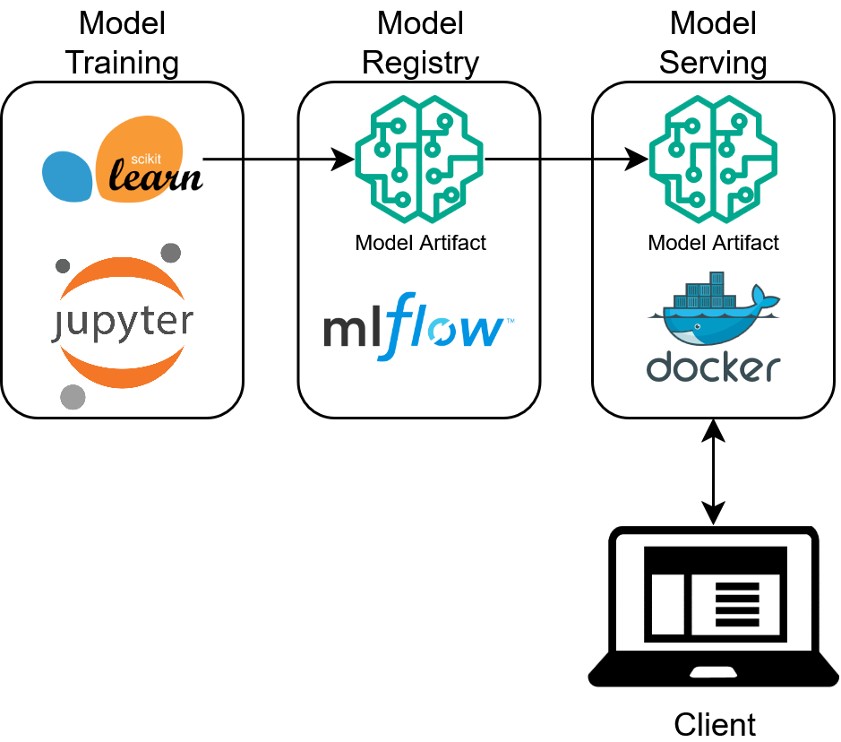
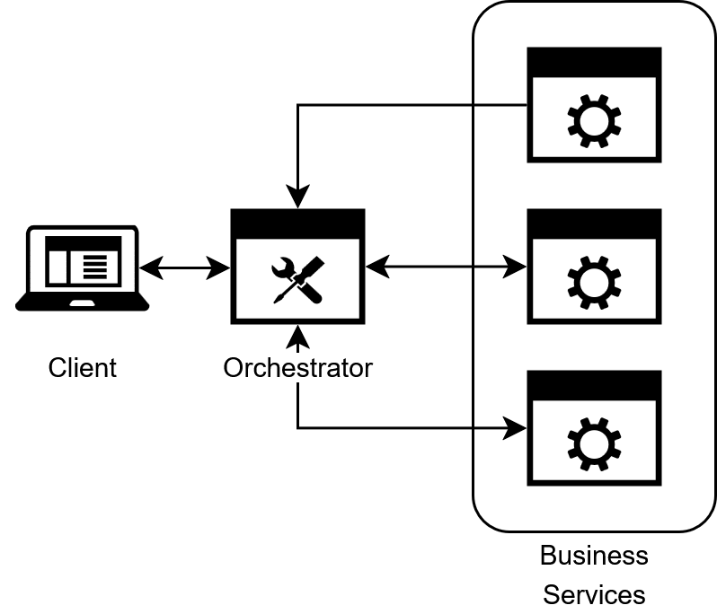
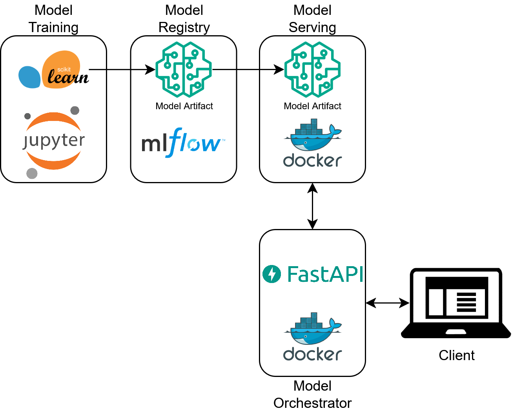
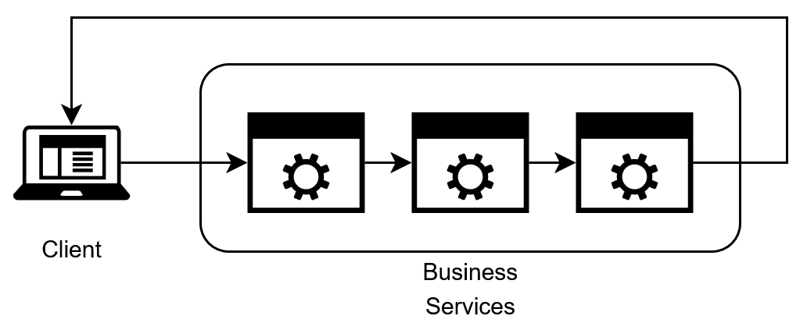

# Delve 15: Let's Build a Modern ML Microservice Application - Part 8, The Orchestrator Service


> "Only a small fraction of real-world ML systems is composed of the ML code... The required surrounding infrastructure is vast and complex." - Hidden Technical Debt in Machine Learning Systems, Sculley et al. 

## Machine Learning Services as a System

Greetings data delvers! In [part seven](2025-06-01-ml-micro-part-seven.md) of this series we finally deployed a model! For this part we'll examine how to utilize our model as part of a larger microservice ecosystem!
<!-- more -->

## A Larger System

As we began to explore in our last delve in this series, the model code alone is just a small part of overall codebase. In this delve we will expand our codebase beyond simply serving the model as an API, but instead look to leverage that API as part of a larger system, but first let's take a look at the system we produced in our last delve:

*Figure 1: A Basic ML Ecosystem*



This system is pretty simple but has some drawbacks when we examine it from the client's perspective. Let's take a look at a a sample API request to see what I mean:

```json title='MLFlow Model API Request'
{
    "dataframe_split": {
        "columns": [
            "Id",
            "MSSubClass",
            "MSZoning",
            "LotFrontage",
            "LotArea",
            "Street",
            "Alley",
            "LotShape",
            "LandContour",
            "Utilities",
            "LotConfig",
            "LandSlope",
            "Neighborhood",
            "Condition1",
            "Condition2",
            "BldgType",
            "HouseStyle",
            "OverallQual",
            "OverallCond",
            "YearBuilt",
            "YearRemodAdd",
            "RoofStyle",
            "RoofMatl",
            "Exterior1st",
            "Exterior2nd",
            "MasVnrType",
            "MasVnrArea",
            "ExterQual",
            "ExterCond",
            "Foundation",
            "BsmtQual",
            "BsmtCond",
            "BsmtExposure",
            "BsmtFinType1",
            "BsmtFinSF1",
            "BsmtFinType2",
            "BsmtFinSF2",
            "BsmtUnfSF",
            "TotalBsmtSF",
            "Heating",
            "HeatingQC",
            "CentralAir",
            "Electrical",
            "1stFlrSF",
            "2ndFlrSF",
            "LowQualFinSF",
            "GrLivArea",
            "BsmtFullBath",
            "BsmtHalfBath",
            "FullBath",
            "HalfBath",
            "BedroomAbvGr",
            "KitchenAbvGr",
            "KitchenQual",
            "TotRmsAbvGrd",
            "Functional",
            "Fireplaces",
            "FireplaceQu",
            "GarageType",
            "GarageYrBlt",
            "GarageFinish",
            "GarageCars",
            "GarageArea",
            "GarageQual",
            "GarageCond",
            "PavedDrive",
            "WoodDeckSF",
            "OpenPorchSF",
            "EnclosedPorch",
            "3SsnPorch",
            "ScreenPorch",
            "PoolArea",
            "PoolQC",
            "Fence",
            "MiscFeature",
            "MiscVal",
            "MoSold",
            "YrSold",
            "SaleType",
            "SaleCondition"
        ],
        "index": [
            0
        ],
        "data": [
            [
                1461,
                20,
                "RH",
                80.0,
                11622,
                "Pave",
                null,
                "Reg",
                "Lvl",
                "AllPub",
                "Inside",
                "Gtl",
                "NAmes",
                "Feedr",
                "Norm",
                "1Fam",
                "1Story",
                5,
                6,
                1961,
                1961,
                "Gable",
                "CompShg",
                "VinylSd",
                "VinylSd",
                null,
                0.0,
                "TA",
                "TA",
                "CBlock",
                "TA",
                "TA",
                "No",
                "Rec",
                468.0,
                "LwQ",
                144.0,
                270.0,
                882.0,
                "GasA",
                "TA",
                "Y",
                "SBrkr",
                896,
                0,
                0,
                896,
                0.0,
                0.0,
                1,
                0,
                2,
                1,
                "TA",
                5,
                "Typ",
                0,
                null,
                "Attchd",
                1961.0,
                "Unf",
                1.0,
                730.0,
                "TA",
                "TA",
                "Y",
                140,
                0,
                0,
                0,
                120,
                0,
                null,
                "MnPrv",
                null,
                0,
                6,
                2010,
                "WD",
                "Normal"
            ]
        ]
    }
}
```

And a sample response:

```json title='MLFlow Model API Response'
{
    "predictions": [
        128528.33
    ]
}
```

While this gets the job done it isn't the most interpretable API contract. Imagine if you were a front end developer and you were asked to produce a request that looked like that to call that backend, you'd probably scream. In addition, while MLFlow is great for getting a model API up and running the validation it does on the data being passed in is minimal. Go ahead and modify the request to put in a value that doesn't exist in the training data for one of the fields like `"Dummy"` and send it to the API, you probably still get a price prediction back! What's happening here is the model is just treating that field as `null` for the purposes of making a prediction. This probably isn't the behavior that we want since it could lead to silent bugs in our code. Finally, the output of our API is not very informative either, `"predictions"` is pretty vague as to what the output is supposed to mean. So in summary the things we'd like to change about our API are:

* Have a more natural REST contract for our API
* Have stricter validation on the data being passed into our API
* Have a more clear response

In order to achieve this we are going to lean on the microservice codebase we built before to orchestrate calls to our model API!

## The Orchestrator Service

The system we have currently built is an example of loose coupling between our client and backend model service. In this setup, both are independent services that could be deployed on their own. This is generally what is desired in a cloud microservice architecture, however the challenge comes in when independent services need to communicate to preform a task (in this case predict the price of a house). We could embed our business logic into our client application itself (validating the inputs, wrangling the request and response JSON, etc.) and this would work for a simple setup. However, what if in the future we have multiple different use cases for our price prediction model each with their own "clients"? Now we would have to replicate our business logic in multiple places which is not ideal. Or, what if we had multiple different models we want to apply as part of our logic (one to predict the price of a house, another to predict its insurance cost, etc.), now to process one house our clients must make calls out to multiple models each with their own contracts, yuck! In either case the solution is to introduce a new dedicated service (the orchestrator service) to control the sequence of API calls needed to perform the task, as well as perform any necessary business logic surrounding the calls. In this way, the orchestrator now becomes responsible for ensuring the workflow to complete the task is executed correctly and consistently each time, rather than relying on each client to remain consistent with each other.

*Figure 2: The Orchestrator Pattern*



This provides a number of benefits:

* Centralized control over workflows ensures consistency across all invocations of the workflow
* It becomes easier to implement more complex workflows which becomes particularly common when working with ML services
* Error handling and recovery becomes easier to manage (If we are using multiple expensive models we won't want to retry the whole flow if only one model fails)
* We now have one convenient place to perform all of our logging and tracing

In the context of our simple ecosystem this pattern would look like this:

*Figure 3: A Basic ML Ecosystem with an Orchestrator Service*



!!! Note
    The **Orchestrator Pattern** is often contrasted with the **Choreography Pattern** in microservice architectural design. In the Choreography Pattern, each service communicates asynchronously by emitting events that other services consume to produce a workflow.

    *Figure 4: The Choreography Pattern*

    

    In practice, both patterns are utilized and we may examine this pattern in future delves as well.

With the theory out of the way, let's write some code!

## Building the Orchestrator: Setup

To start off we need to modify our project structure to include an additional project within our workspace to house our orchestrator service. We can rely on the uv workspace concept we introduced in the [previous delve](2025-06-01-ml-micro-part-seven.md) to do this pretty easily! Add a new folder in the root of our project called `housing-price-orchestrator` with its own `pyproject.toml`:

```toml title="housing-price-orchestrator/pyproject.toml" linenums="1"
[project]
name = "housing-price-orchestrator"
version = "0.1.0"
description = "Example repository of how to orchestrate a price regression model."
readme = "README.md"
requires-python = ">=3.13"
```

Then we need to update the root `pyproject.toml` to include it:

```toml title="pyproject.toml" linenums="1" hl_lines="10"
[project]
name = "modern-ml-microservices"
version = "0.1.0"
description = "Example repository of how to build a modern microservice architecture to support machine learning applications."
readme = "README.md"
requires-python = ">=3.13"
dependencies = []

[tool.uv.workspace]
members = ["housing-price-model", "housing-price-orchestrator"]
```

Finally, our orchestrator is going to be in the style of the service we built in [part six](2025-05-04-ml-micro-part-six.md) so we can go ahead and give it a similar directory structure with a `src` and `tests` directory, each with their respective sub-directories. Our final directory structure should look something like this:

``` title="Full Project Structure"
├── .git
├── .gitignore
├── .python-version
├── LICENSE
├── README.md
├── compose.yaml
├── housing-price-model
├── housing-price-orchestrator
│   ├── pyproject.toml
│   ├── src
│   │   ├── provider
│   │   ├── service
│   │   └── shared
│   └── tests
│       ├── integration
│       └── unit
├── mlflow-server
├── pyproject.toml
└── uv.lock
```

!!! Tip
    For the rest of this delve we will be doing a speed-run of the first 6 parts to build an orchestrator service. It's a good idea to review the corresponding part if at any point the steps seem unclear.

## Building the Orchestrator: The Data Layer

We can now follow a similar setup to the first six parts of this series beginning with the data layer. To start we need to do a bit more configuration of VScode to let it know where our source code will be located since it's not in the root of our project:

```json title=".vscode/launch.json" linenums="1"
{
    "python.autoComplete.extraPaths": [
        "${workspaceFolder}/housing-price-orchestrator/src"
    ],
    "python.analysis.extraPaths": [
        "${workspaceFolder}/housing-price-orchestrator/src"
    ]
}
```

Next we need to model our MLFlow API response (make sure you create the correct base classes as before):

```python title="housing-price-orchestrator/src/shared/view/mlflow_view.py" linenums="1"
from typing import Any
from shared.data_model_base import ViewBase


class MLFlowPredictionsView(ViewBase):
    """View model for the prediction results of a machine learning model."""

    predictions: list[Any]
    """List of predictions made by the model."""
```

And a corresponding provider:

```python title="housing-price-orchestrator/src/shared/provider/mlflow_view.py" linenums="1"
from typing import Optional
import httpx
import pandas as pd
from shared.view.mlflow_view import MLFlowPredictionsView
import json


class MLFlowModelProvider:
    """Provider for interacting with MLFlow models.

    Args:
        model_uri: The URI of the MLFlow model.
        client: An optional httpx client for making requests. If not provided, a new client will be created.
    """

    def __init__(self, base_url: str, client: Optional[httpx.Client] = None):
        self.base_url = base_url
        self.client = client or httpx.Client()

    def health(self) -> bool:
        """Checks the health of the MLFlow model provider.

        Returns:
            A string indicating the health status of the model provider.
        """
        try:
            response = httpx.get(f'{self.base_url}/ping')
            return response.status_code == 200
        except httpx.RequestError:
            return False

    def predict(self, data: pd.DataFrame) -> MLFlowPredictionsView:
        """Makes a prediction using the MLFlow model.

        Args:
            data: The input data for the prediction.

        Returns:
            A ModelPredictionsView containing the predictions.

        Raises:
            HTTPStatusError: If the prediction request fails.
        """

        payload = {'dataframe_split': json.loads(data.to_json(orient='split'))}

        response = self.client.post(f'{self.base_url}/invocations', json=payload)
        response.raise_for_status()

        predictions = response.json()
        return MLFlowPredictionsView.model_validate(predictions)
```

A few notes here:

* We add an optional `httpx.Client` in the constructor, this allows us to reuse the same client connection multiple times rather than creating a new connection each time (as is the default httpx behavior). Functionally this changes nothing about the code but can provide a nice performance bump.
* This provider knows nothing about the specifics of our model but instead takes in a pandas dataframe and produces a generic response. This is intentional, as it allows us to **reuse this provider for any MLFlow model**. 

That wraps up our data layer, onto the next one!

## Building the Orchestrator: The Business Logic Layer

For our BLL we create a `PricingService`. It is in this layer we take our generic `MLFlowModelProvider` and tailor it to our specific business context. To start we need to model our request and response from the service:

```python title="housing-price-orchestrator/src/shared/view/request_view.py" linenums="1"
from shared.data_model_base import ViewBase
from typing import Literal, Optional
from pydantic import Field


class PricePredictionRequest(ViewBase):
    """View model for the request to predict housing prices."""

    id: int = Field(ge=1, serialization_alias='Id')
    """Unique identifier for the housing unit."""

    ms_sub_class: int = Field(ge=20, le=190, serialization_alias='MSSubClass')
    """Identifies the type of dwelling involved in the sale"""

    ms_zoning: Literal['A', 'C', 'FV', 'I', 'RH', 'RL', 'RP', 'RM'] = Field(serialization_alias='MSZoning')
    """Identifies the general zoning classification of the sale"""

    # This is only a subset of fields, the full class is available here: https://github.com/DataDelver/modern-ml-microservices/blob/part-eight/housing-price-orchestrator/src/shared/view/request_view.py#L6 
```

!!! Tip
    This data model is **massive**. Instead of modeling it all by hand this was actually a very good use case for Generative AI. I used the Copilot chat feature of VSCode to prompt Copilot to generate a data model given a sample input row as well as the `data_description.txt` file from Kaggle. It did a great job with minimal tweaking. Much better than writing all the code by hand!

One subtle thing to note is the `serialization_alias` on this model. The input csv of our model had the columns in PascalCase as well as non standard formats such as starting with numbers. When we send this data to the model those field names must match. However, in our orchestrator REST API contact, we'd like to use standard JSON camelCase and avoid non-standard formats. This is what the `serialization_alias` allows us to do! We can use the standard `alias_generator` of our `ViewBase` class to validate the JSON we parse to our model, but use a separate `serialization_alias` when sending the data to our MLFlow API. 

This view only models a single request, we can also model a batch prediction view as well, which is just a list of individual requests:

```python title="housing-price-orchestrator/src/shared/view/request_view.py" linenums="322"
from shared.data_model_base import ViewBase
from typing import Literal, Optional
from pydantic import Field


class PricePredictionBatchRequest(ViewBase):
    """View model for a batch request to predict housing prices."""

    data: list[PricePredictionRequest]
    """List of housing data dictionaries to be used for predictions."""
```

We also need to create a DTO to model the response from our service layer:

```python title="housing-price-orchestrator/src/shared/dto/price_prediction.py" linenums="1"
from pydantic import Field
from shared.data_model_base import DTOBase


class PricePrediction(DTOBase):
    """Data Transfer Object for price prediction requests."""

    id: int = Field(ge=1)
    """Unique identifier for the housing unit."""

    predicted_price: float = Field(gt=0)
    """Predicted price of the housing unit."""
```

In addition to the price we also include an `id` field. This is to make it easier to join the prediction back to the original input row that produced it.

Finally, with our views and DTOs created, we can build our `PricingService`:

```python title="housing-price-orchestrator/src/service/pricing_service.py" linenums="1"
from provider.mlflow_model_provider import MLFlowModelProvider
from shared.view.request_view import PricePredictionRequest, PricePredictionBatchRequest
from shared.dto.price_prediction import PricePrediction
import pandas as pd


class PricingService:
    def __init__(self, pricing_model_provider: MLFlowModelProvider):
        self.pricing_model_provider = pricing_model_provider

    def predict_price(self, price_prediction_request: PricePredictionRequest) -> PricePrediction:
        """Predicts the price using the MLFlow model provider.

        Args:
            data: The input data for the prediction.

        Returns:
            A view containing the predictions.
        """

        input_data = price_prediction_request.model_dump(by_alias=True)

        input_df = pd.DataFrame([input_data])
        predictions = self.pricing_model_provider.predict(input_df)
        predicted_price = predictions.predictions[0] if predictions.predictions else None

        if predicted_price is None:
            raise ValueError('No predictions returned from the model.')

        return PricePrediction(id=price_prediction_request.id, predicted_price=predicted_price)

    def predict_price_batch(self, price_prediction_batch_request: PricePredictionBatchRequest) -> list[PricePrediction]:
        """Predicts the prices for a batch of requests using the MLFlow model provider.

        Args:
            price_prediction_batch_request: The batch request containing multiple price prediction requests.

        Returns:
            A list of views containing the predictions.
        """

        input_data = price_prediction_batch_request.model_dump(by_alias=True)
        input_df = pd.DataFrame(input_data['data'])
        predictions = self.pricing_model_provider.predict(input_df)
        predicted_prices = predictions.predictions if predictions.predictions else []

        if not predicted_prices:
            raise ValueError('No predictions returned from the model.')

        return [
            PricePrediction(id=req.id, predicted_price=price)
            for req, price in zip(price_prediction_batch_request.data, predicted_prices)
        ]
```

Take note how we are using `price_prediction_request.model_dump(by_alias=True)` when serializing the input views, this ensures the model is receiving the column names it is expecting. Depending on your use case, you might have a batch or single record prediction flow. This service supports both and importantly can use the same provider call in each case!

All that's left now is to expose an interface to our service!

## Building the Orchestrator: The Interface Layer

To expose our service we create a simple interface layer using FastAPI:

```python title="housing-price-orchestrator/src/main.py" linenums="1"
import os
from fastapi import FastAPI, HTTPException
import httpx
from service.pricing_service import PricingService
from provider.mlflow_model_provider import MLFlowModelProvider
from shared.config.config_loader import load_config_settings
from shared.view.request_view import PricePredictionBatchRequest, PricePredictionRequest
from shared.view.response_view import PricePredictionBatchResponseView, PricePredictionResponseView

app = FastAPI()
app_settings = load_config_settings(os.getenv('ENV', 'dev'))

# Initialize HTTP client
client = httpx.Client()
pricing_service = PricingService(MLFlowModelProvider(app_settings.pricing_model_url, client))


@app.post('/api/v1/price/predict')
def predict(price_prediction_request: PricePredictionRequest) -> PricePredictionResponseView:
    """Endpoint to predict the price of a housing unit.

    Args:
        price_prediction_request: The request containing the input data for the prediction.

    Returns:
        A PricePredictionResponseView containing the predicted price.
    """

    try:
        price_prediction = pricing_service.predict_price(price_prediction_request)
        return PricePredictionResponseView(id=price_prediction.id, predicted_price=price_prediction.predicted_price)
    except ValueError:
        raise HTTPException(status_code=404, detail='No results found.')


@app.post('/api/v1/price/predict/batch')
def batch_predict(price_prediction_requests: PricePredictionBatchRequest) -> PricePredictionBatchResponseView:
    """Endpoint to predict the price of multiple housing units.

    Args:
        price_prediction_requests: A list of requests containing the input data for the predictions.

    Returns:
        A list of PricePredictionResponseView containing the predicted prices.
    """

    try:
        price_predictions = pricing_service.predict_price_batch(price_prediction_requests)
        return PricePredictionBatchResponseView(
            predictions=[
                PricePredictionResponseView(id=pred.id, predicted_price=pred.predicted_price)
                for pred in price_predictions
            ]
        )
    except ValueError:
        raise HTTPException(status_code=404, detail='No results found.')
```

A few notes:

* We are using the same config loader pattern as in previous delves to hold the url of the model API
* We instantiate the `httpx.Client` globally so it can be re-used across multiple invocations
* We are including a version number: `v1` as part of our url, this insures if we need to make a breaking change to our API in the future we can clearly denote which contract version our route supports

## Building the Orchestrator: Testing

Don't forget about the importance of testing our code! In order to test our code we need to add a few configuration settings to our main `pyproject.toml` file to tell pytest where our tests are:

```toml title="pyproject.toml" linenums="1" hl_lines="21-45"
[project]
name = "modern-ml-microservices"
version = "0.1.0"
description = "Example repository of how to build a modern microservice architecture to support machine learning applications."
readme = "README.md"
requires-python = ">=3.13"
dependencies = []

[tool.uv.workspace]
members = ["housing-price-model", "housing-price-orchestrator"]

[tool.ruff]
line-length = 120

[tool.ruff.format]
quote-style = "single"

[tool.ruff.lint.pydocstyle]
convention = "google"

[tool.pytest.ini_options]
minversion = "6.0"
pythonpath = [
    "housing-price-orchestrator/src"
]
testpaths = [
    "housing-price-orchestrator/tests",
]
python_files = [
    "test_*.py",
    "inttest_*.py",
]

[tool.coverage.run]
omit = [
    "housing-price-orchestrator/tests",
]
source = [
    "housing-price-orchestrator/src",
]

[tool.coverage.report]
fail_under = 60 
show_missing = true
skip_empty = true
```

If you haven't already, make sure your ruff configurations are included there as well. Next we create unit and integration tests for each of our classes, for example, here's how you can test the `MLFlowModelProvider`:

```python title="housing-price-orchestrator/tests/unit/provider/test_mlflow_model_provider.py" linenums="1"
import pandas as pd
import httpx
import pytest
from unittest.mock import MagicMock

from provider.mlflow_model_provider import MLFlowModelProvider
from shared.view.mlflow_view import MLFlowPredictionsView


def test_health_success(mocker):
    """Test the health method returns True when /ping returns 200."""
    # GIVEN
    mocker.patch('httpx.get', return_value=MagicMock(status_code=200))
    provider = MLFlowModelProvider(base_url='http://fake-url')

    # WHEN
    result = provider.health()

    # THEN
    assert result is True


def test_health_failure(mocker):
    """Test the health method returns False when /ping raises an error."""
    # GIVEN
    mocker.patch('httpx.get', side_effect=httpx.RequestError('fail'))
    provider = MLFlowModelProvider(base_url='http://fake-url')

    # WHEN
    result = provider.health()

    # THEN
    assert result is False


def test_predict_success(mocker):
    """Test the predict method returns MLFlowPredictionsView on success."""
    # GIVEN
    mock_client = MagicMock()
    provider = MLFlowModelProvider(base_url='http://fake-url', client=mock_client)
    df = pd.DataFrame([{'a': 1, 'b': 2}])
    expected_payload = {'dataframe_split': df.to_dict(orient='split')}
    mock_response = MagicMock()
    mock_response.json.return_value = {'predictions': [123.45]}
    mock_client.post.return_value = mock_response
    mock_response.raise_for_status.return_value = None
    mocker.patch.object(
        MLFlowPredictionsView, 'model_validate', return_value=MLFlowPredictionsView(predictions=[123.45])
    )

    # WHEN
    result = provider.predict(df)

    # THEN
    mock_client.post.assert_called_once()
    assert isinstance(result, MLFlowPredictionsView)
    assert result.predictions == [123.45]


def test_predict_http_error(mocker):
    """Test the predict method raises if HTTP error occurs."""
    # GIVEN
    mock_client = MagicMock()
    provider = MLFlowModelProvider(base_url='http://fake-url', client=mock_client)
    df = pd.DataFrame([{'a': 1, 'b': 2}])
    mock_response = MagicMock()
    mock_response.raise_for_status.side_effect = httpx.HTTPStatusError(
        'fail', request=MagicMock(), response=MagicMock()
    )
    mock_client.post.return_value = mock_response

    # WHEN / THEN
    with pytest.raises(httpx.HTTPStatusError):
        provider.predict(df)
```

A full collection of tests can be found [here](https://github.com/DataDelver/modern-ml-microservices/tree/part-eight/housing-price-orchestrator/tests)!

!!! tip
    Writing tests is another area where GenAI shines, I utilized Github Copilot to generate these tests with a bit of prompting.

With our code now tested let's Dockerize it so it can be deployed!

## Building the Orchestrator: Dockerizing

To start we need to define our Dockerfile for our orchestrator, no surprises here, it's almost same one we've used before!

```docker title="housing-price-orchestrator/Dockerfile" linenums="1"
FROM ghcr.io/astral-sh/uv:python3.13-bookworm-slim

# Install the project into `/app`
WORKDIR /app

# Enable bytecode compilation
ENV UV_COMPILE_BYTECODE=1

# Copy from the cache instead of linking since it's a mounted volume
ENV UV_LINK_MODE=copy

# Install the project's dependencies using the lockfile and settings
RUN --mount=type=cache,target=/root/.cache/uv \
    --mount=type=bind,source=uv.lock,target=uv.lock,from=project_root \
    --mount=type=bind,source=pyproject.toml,target=pyproject.toml \
    uv sync --frozen --no-install-project --no-dev

# Then, copy the rest of the project source code and install it
# Installing separately from its dependencies allows optimal layer caching
COPY . /app
RUN --mount=type=cache,target=/root/.cache/uv \
    --mount=type=bind,source=uv.lock,target=uv.lock,from=project_root \
    uv sync --frozen --no-dev

# Place executables in the environment at the front of the path
ENV PATH="/app/.venv/bin:$PATH"

# Reset the entrypoint, don't invoke `uv`
ENTRYPOINT []

# Run the FastAPI application by default
CMD ["fastapi", "run", "src/main.py", "--port", "8000"]
```

You may have noticed this `from=project_root` section of the mounts. What's going on here? This has to do with the Docker build context. Our `uv.lock` file is in the root of the project. However, our Dockerfile is nested underneath the `housing-price-orchestrator` directory. We'd like to use this directory as the Docker build context so that all of the `COPY` commands work correctly, but this excludes the `uv.lock` file. Fortunately Docker has the concept of [additional contexts](https://docs.docker.com/reference/compose-file/build/#additional_contexts) to support including additional directories as part of the build which is what we are leveraging here. We create the `project_root` context as part of our `compose.yaml`: 

```yaml title="compose.yaml" linenums="1"
services:
  housing-price-model:
    build:
      context: housing-price-model/build
      dockerfile: Dockerfile
    ports:
      - "8080:8080"
      - "8081:8081"
      - "8082:8082"
  housing-price-orchestrator:
    build: 
      context: housing-price-orchestrator
      additional_contexts:
        project_root: .
    environment:
      - ENV=dev
    ports:
      - "8000:8000"
    depends_on:
      - housing-price-model
```

!!! note
    The build for the price model container has been changed as well, instead of referencing an already built image, the image is built as part of the `docker compose` command, this is personal preference, either approach is acceptable.

Compose also lets us specify the dependency between the orchestrator service and the model service, ensuring the price model is spun up first before the orchestrator.

## Running our Orchestrator!

With our compose configured we can spin up our services by first executing `docker compose build` and then `docker compose up`, you should see something like the following:

```
$docker compose up
Attaching to housing-price-model-1, housing-price-orchestrator-1
housing-price-orchestrator-1  | 
housing-price-orchestrator-1  |    FastAPI   Starting production server 🚀
housing-price-orchestrator-1  |  
housing-price-orchestrator-1  |              Searching for package file structure from directories with         
housing-price-orchestrator-1  |              __init__.py files                                                  
housing-price-orchestrator-1  |              Importing from /app/src
housing-price-orchestrator-1  |  
housing-price-orchestrator-1  |     module   🐍 main.py
housing-price-orchestrator-1  |  
housing-price-orchestrator-1  |       code   Importing the FastAPI app object from the module with the following
housing-price-orchestrator-1  |              code:                                                              
housing-price-orchestrator-1  |  
housing-price-orchestrator-1  |              from main import app
housing-price-orchestrator-1  |  
housing-price-orchestrator-1  |        app   Using import string: main:app
housing-price-orchestrator-1  |  
housing-price-orchestrator-1  |     server   Server started at http://0.0.0.0:8000
housing-price-orchestrator-1  |     server   Documentation at http://0.0.0.0:8000/docs
housing-price-orchestrator-1  |  
housing-price-orchestrator-1  |              Logs:
housing-price-orchestrator-1  |  
housing-price-orchestrator-1  |       INFO   Started server process [1]
housing-price-orchestrator-1  |       INFO   Waiting for application startup.
housing-price-orchestrator-1  |       INFO   Application startup complete.
housing-price-orchestrator-1  |       INFO   Uvicorn running on http://0.0.0.0:8000 (Press CTRL+C to quit)
housing-price-model-1         | /usr/local/lib/python3.13/site-packages/starlette_exporter/middleware.py:97: FutureWarning: group_paths and filter_unhandled_paths will change defaults from False to True in the next release. See https://github.com/stephenhillier/starlette_exporter/issues/79 for more info
housing-price-model-1         |   warnings.warn(
housing-price-model-1         | 2025-08-17 19:02:14,704 [mlserver.parallel] DEBUG - Starting response processing loop...
housing-price-model-1         | 2025-08-17 19:02:14,723 [mlserver.rest] INFO - HTTP server running on http://0.0.0.0:8080
housing-price-model-1         | INFO:     Started server process [70]
housing-price-model-1         | INFO:     Waiting for application startup.
housing-price-model-1         | 2025-08-17 19:02:14,833 [mlserver.metrics] INFO - Metrics server running on http://0.0.0.0:8082
housing-price-model-1         | 2025-08-17 19:02:14,833 [mlserver.metrics] INFO - Prometheus scraping endpoint can be accessed on http://0.0.0.0:8082/metrics
housing-price-model-1         | INFO:     Started server process [70]
housing-price-model-1         | INFO:     Waiting for application startup.
housing-price-model-1         | INFO:     Application startup complete.
housing-price-model-1         | 2025-08-17 19:02:16,363 [mlserver.grpc] INFO - gRPC server running on http://0.0.0.0:8081
housing-price-model-1         | INFO:     Application startup complete.
housing-price-model-1         | INFO:     Uvicorn running on http://0.0.0.0:8082 (Press CTRL+C to quit)
housing-price-model-1         | INFO:     Uvicorn running on http://0.0.0.0:8080 (Press CTRL+C to quit)
housing-price-model-1         | 2025-08-17 19:02:19,153 [mlserver] INFO - Loaded model 'mlflow-model' succesfully.
```

Compose will nicely separate out the logs for each service for us. With our services up and running we can now hit our orchestrator! Go ahead and hit `http://localhost:8000/api/v1/price/predict` with the following request using your REST client of choice:

```json title="Orchestrator API Request"
{
    "id": 1461,
    "msSubClass": 20,
    "msZoning": "RH",
    "lotFrontage": 80,
    "lotArea": 11622,
    "street": "Pave",
    "alley": null,
    "lotShape": "Reg",
    "landContour": "Lvl",
    "utilities": "AllPub",
    "lotConfig": "Inside",
    "landSlope": "Gtl",
    "neighborhood": "NAmes",
    "condition1": "Feedr",
    "condition2": "Norm",
    "bldgType": "1Fam",
    "houseStyle": "1Story",
    "overallQual": 5,
    "overallCond": 6,
    "yearBuilt": 1961,
    "yearRemodAdd": 1961,
    "roofStyle": "Gable",
    "roofMatl": "CompShg",
    "exterior1St": "VinylSd",
    "exterior2Nd": "VinylSd",
    "masVnrType": null,
    "masVnrArea": 0,
    "exterQual": "TA",
    "exterCond": "TA",
    "foundation": "CBlock",
    "bsmtQual": "TA",
    "bsmtCond": "TA",
    "bsmtExposure": "No",
    "bsmtFinType1": "Rec",
    "bsmtFinSf1": 468,
    "bsmtFinType2": "LwQ",
    "bsmtFinSf2": 144,
    "bsmtUnfSf": 270,
    "totalBsmtSf": 882,
    "heating": "GasA",
    "heatingQc": "TA",
    "centralAir": "Y",
    "electrical": "SBrkr",
    "firstFlrSf": 896,
    "secondFlrSf": 0,
    "lowQualFinSf": 0,
    "grLivArea": 896,
    "bsmtFullBath": 0,
    "bsmtHalfBath": 0,
    "fullBath": 1,
    "halfBath": 0,
    "bedroomAbvGr": 2,
    "kitchenAbvGr": 1,
    "kitchenQual": "TA",
    "totRmsAbvGrd": 5,
    "functional": "Typ",
    "fireplaces": 0,
    "fireplaceQu": null,
    "garageType": "Attchd",
    "garageYrBlt": 1961,
    "garageFinish": "Unf",
    "garageCars": 1,
    "garageArea": 730,
    "garageQual": "TA",
    "garageCond": "TA",
    "pavedDrive": "Y",
    "woodDeckSf": 140,
    "openPorchSf": 0,
    "enclosedPorch": 0,
    "threeSsnPorch": 0,
    "screenPorch": 120,
    "poolArea": 0,
    "poolQc": null,
    "fence": "MnPrv",
    "miscFeature": null,
    "miscVal": 0,
    "moSold": 6,
    "yrSold": 2010,
    "saleType": "WD",
    "saleCondition": "Normal"
}
```

You should get back a response that looks something like this:

```json title="Orchestrator API Response"
{
    "id": 1461,
    "predictedPrice": 128528.33
}
```

Importantly try changing the request to include an invalid value such as `Dummy` for the `street` field, instead of getting back a 200 response you should now get a pydantic validation error:

```json title="Orchestrator API Validation Error Response"
{
    "detail": [
        {
            "type": "literal_error",
            "loc": [
                "body",
                "street"
            ],
            "msg": "Input should be 'Grvl' or 'Pave'",
            "input": "Dummy",
            "ctx": {
                "expected": "'Grvl' or 'Pave'"
            }
        }
    ]
}
```

Much nicer! I'll leave trying out the batch endpoint to you 🙂

## Orchestrated Chaos

With the creation of the orchestrator service we have now created what I consider an MVP production system. There is still more functionality to add (and more delves to complete!), but this system now has the core functionality of a user-friendly API for producing model predictions as well as a tested code base. Subsequent delves will expand on this core to cover additional use cases and add more quality of life features. Congratulations on making it this far! Code for this part can be found [here](https://github.com/DataDelver/modern-ml-microservices/tree/part-eight)!

## Delve Data
* Exposing MLFlow model APIs directly comes with several drawbacks
* Utilizing the Microservice Orchestration Pattern can get us around these drawbacks
* Using a combination of uv workspaces and Docker compose we can easily create this multi-service setup in one codebase
