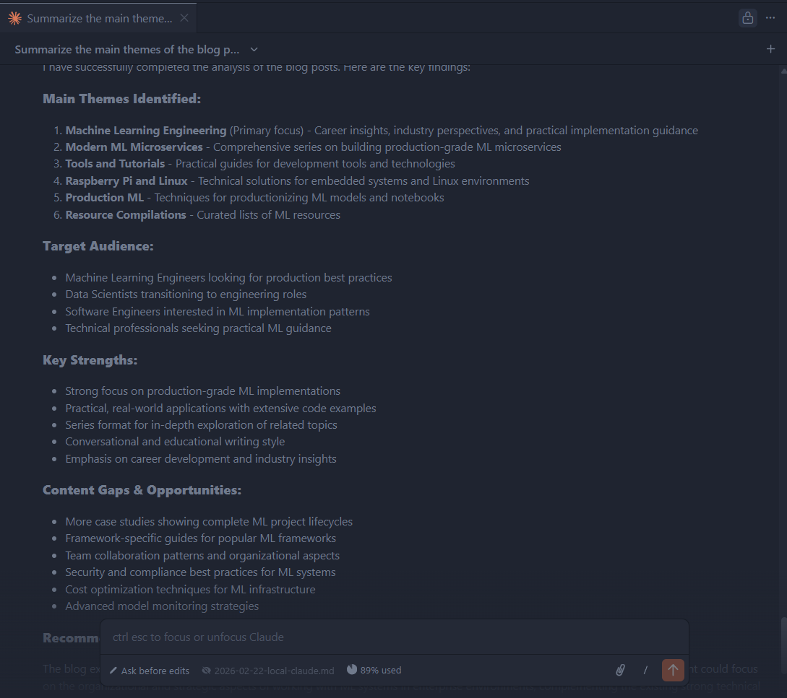

# Delve 21: A Local Claude Code


> "The right tool doesn't just make a job easier; it changes how you think about the problem." - Gemini 3

Hello data delvers! Though I am cautiously skeptical of the hype around AI, one area that I have seen my own productivity increase is by leveraging AI as a pair programmer. Up until this point, I have primarily relied on Github Copilot as my AI assistant. However, I recently gave Claude Code a try at work and was pleasantly surprised at its ability to go beyond what I had seen from Copilot and really "pair" with me. Based on these results, I resolved to set it up on my own machine to use for my personal projects. However, not wanting to spend money on tokens I wanted to be able to run an LLM locally and connect it to Claude Code. Fortunately with the latest release of Ollama this is a pretty straightforward thing to do!
<!-- more -->

## Ollama, Oh Lama?

[Ollama](https://ollama.com/) is a leading open-source framework that enables you to run Large Language Models (LLMs) completely locally and connect them to a variety of applications. In a [recent release](https://ollama.com/blog/claude), it added support for connecting directly to Claude Code.

Getting started with Ollama is as simple as running the following install script from the command line on Linux or Mac:

`curl -fsSL https://ollama.com/install.sh | sh`

Once Ollama is installed you can start it by running:

`ollama serve`

The next step is to choose which LLM you want to use!

## LLMs A Plenty

There are many different LLMs you may choose based on your available hardware. Some of the most popular currently include:

* [devstral-small-2](https://ollama.com/library/devstral-small-2) - Generally considered a good baseline if you have a decent amount of RAM (25GB) and a GPU available.
* [qwen3-coder](https://ollama.com/library/qwen3-coder) - Another strong model but more resource intensive (32GB+ RAM), generally considered one of the best models currently available.
* [flash:q8_0](https://ollama.com/library/glm-4.7-flash:q8_0) - A model prioritizing speed and low latency with quantized weights.

!!! note 
    Konstantin Taletskiy gave a very detailed breakdown of several different models you could consider in a great blog post [here](https://taletskiy.com/blogs/ollama-claude-code/)!

Once you've decided which LLM you prefer you can install it in a new terminal by running:

`ollama pull <model_name>`

## Claude!

Your next step is to install [Claude Code](https://code.claude.com/docs/en/overview)! On Linux or Mac you can again run a simple shell script:

`curl -fsSL https://claude.ai/install.sh | bash`

We then have to configure Claude to point to the local Ollama instance. The easiest way to do this is to modify the Claude `settings.json` file (by default located at `~/.claude/settings.json`) to add in the following environment variables:

```json title="~/.claude/settings.json" linenums="1"
{
    "$schema": "https://json.schemastore.org/claude-code-settings.json",
    "env": {
        "ANTHROPIC_AUTH_TOKEN": "ollama",
        "ANTHROPIC_BASE_URL": "http://localhost:11434"
    }
}
```

## Ollama + Claude = ✨

Next, I recommend killing your running Ollama instance and re-running it with a larger context window (the default context window of 2048 tokens is rather limiting):

`OLLAMA_CONTEXT_LENGTH=32768 ollama serve`

You can then launch claude with your model of choice:

`claude --model <model_name>`


Congratulations! You now have a fully-local Claude Code instance!

## That GUI Feel

If you are like me and coming from Github Copilot you may find having to use the CLI jarring. Fortunately, there is a [Claude Code VS Code Plugin](https://code.claude.com/docs/en/vs-code) that will provide a seamless integration within the IDE. In order to get it to work you will need to follow the [steps for using third party providers](https://code.claude.com/docs/en/vs-code#use-third-party-providers), namely, disabling the login prompt.

You will also need to go into the extension settings and set your selected model to your local LLM.

With that, you should be good to open up the Claude Code extension and get coding!



## Delve Data

* Running LLMs locally with Ollama provides a cost-effective alternative to cloud-based AI services.
* Ollama supports a variety of models with different resource requirements and performance characteristics.
* Claude Code can be configured to use a local Ollama instance instead of cloud APIs.
* Increasing the context window (e.g., to 32768 tokens) improves Claude Code's ability to handle complex codebases.
* The Claude Code VS Code extension provides seamless IDE integration for local LLM usage.
* Using local LLMs with Claude Code enables private, offline AI-assisted development.
