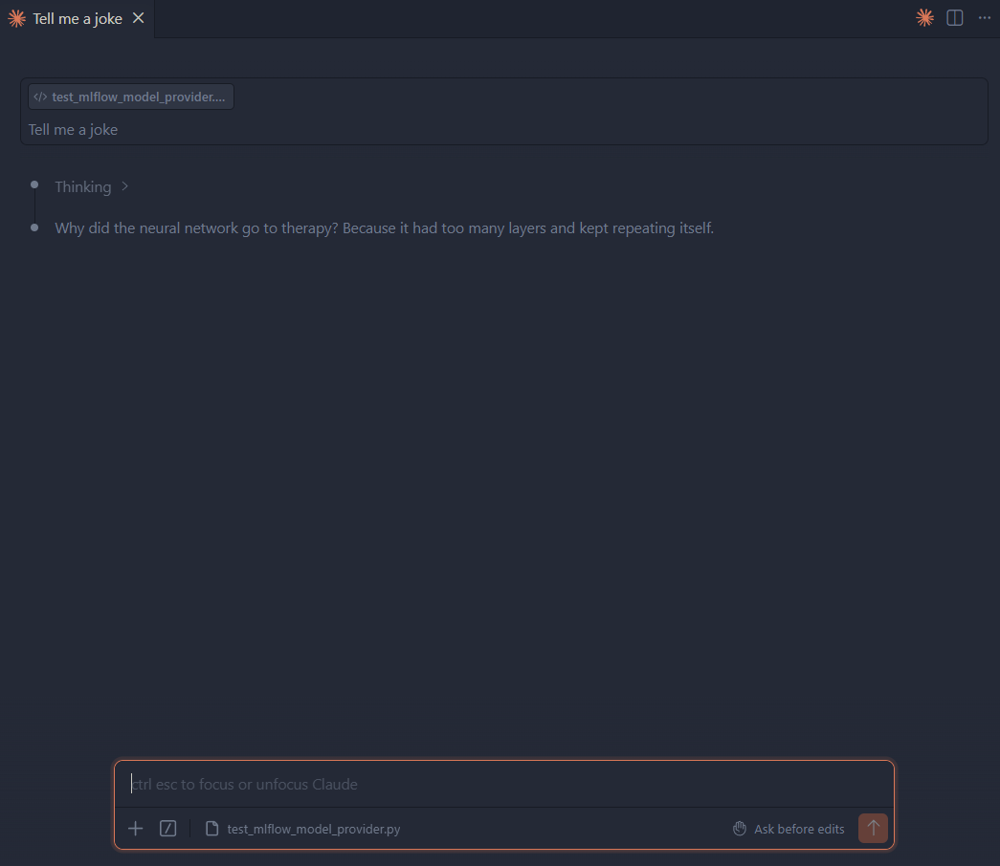

# Delve 22: A Local Claude Code Redux


Hello data delvers! It's been some time but I'm back with more delves! In the time since my [previous delve](2026-02-22-local-claude.md) the landscape for local llm development has already shifted quite a bit so I want to come back with a refreshed setup guide!
<!-- more -->

## llama.cpp

I recently read an [opinion piece](https://sleepingrobots.com/dreams/stop-using-ollama/) by Zetaphor around the history of Ollama which I found quite compelling, as a result I resolved to shift my local setup to `llama.cpp` which thankfully was not all that complicated.

To get started, use your [installer of choice](https://github.com/ggml-org/llama.cpp/blob/master/docs/install.md) to install `llama.cpp` on your machine.

```bash
winget install llama.cpp
```

!!! note
    Since I use WSL as my primary dev environment I will be installing `llama.cpp` on *Windows* with `winget` and then connecting to WSL over a local network. This ensures that the model will have full access to all of my system RAM and GPU memory.

## Even More LLMs

Since we are now using `llama.cpp` we have full access to the enormous library of models available on [Hugging Face](https://huggingface.co/), since our last delve, some of the new models that have come out are:

* [Qwen3.6](https://huggingface.co/Qwen/Qwen3.6-27B) - Positioned as the specialist for agentic, repository-level coding, this model series (27B dense / 35B MoE) from Alibaba differentiates itself by natively preserving its internal reasoning context across multi-turn conversations, preventing the cognitive degradation often seen in iterative development cycles.

* [Gemma 4](https://huggingface.co/google/gemma-4-12B) - Designed for extreme intelligence-per-parameter efficiency across diverse hardware, this multimodal family from Google spans from light on-device models up to a 31B dense variant, using per-layer embeddings to keep memory usage low while matching the knowledge footprint of much heavier models

* [Mistral Medium 3.5](https://huggingface.co/mistralai/Mistral-Medium-3.5-128B) - Serves as the high-capacity, unified enterprise engine (128B dense) that merges previously separate chat, math, and code architectures into one powerhouse; unlike the other two, it features configurable test-time compute, allowing you to scale its reasoning effort up for heavy asynchronous agent workflows or down for rapid-fire chat.

Now if that all sounded like AI-generated, uninterpretable jargon, that's because it was! In practice, I recommend reading up on each of the current models on resources such as [r/LocalLLM](https://www.reddit.com/r/LocalLLM/) to get a feel for what the community finds each model useful for.

After doing some of my own research I decided to select the `Gemma4` family of models for my current setup.

## Community For The Win!

One of the best parts about the Hugging Face community is that individuals often release optimized versions of models for specific tasks. For example, Yuxin Lu has created fine-tuned variants of the Gemma 4 12B model specifically for coding which you can grab [here](https://huggingface.co/yuxinlu1/gemma-4-12B-agentic-fable5-composer2.5-v2-3.5x-tau2-GGUF)!

!!! warning
    I'd be sure to do your own research before using community models to ensure they are safe.

## Quant Selection

One of the best ways to fit a large model on your local device is to use quantization. When a model is trained, its weights are saved in a high-precision format, typically BF16 or FP16 (16-bit floating-point numbers). Quantization compresses these weights into lower-bit integers (such as 4-bit, 6-bit, or 8-bit).

Models often have a suffix to indicate what level of quantization was used to produce them such as `Q4_K_M`. These are colloquially referred to as "Quants" of a model. This is comprised of 3 parts:

1. Bit Depth (`Q4`, `Q6`, `Q8`) — How many bits are used to store each weight; a lower number indicates higher compression and more performance loss.

2. Quantization Method (`K`) — The method used to produce the quantization. `K` is the typical modern standard, though other older variants such as `0` exist as well.

3. Granularity (`M`) — Particularly with `K` Quants, you will see a suffix indicating its size (`S`, `M`, `L`), indicating the level of compression within that bit-depth.

With all that being said `Q4_K_M` tends to be the most popular size of quantization at it usually strikes a balance between required GPU memory size and model performance.

## Launch 🚀

Once you've selected your model and quant size, the next step is to create a launch script. Here is the one (for PowerShell) that I'm using below:

```powershell title="Start-Gemma4.ps1" linenums="1"
<#
.SYNOPSIS
    Starts a highly optimized llama-server instance for Claude Code using Gemma 4 Q4_K_M.
.DESCRIPTION
    Allocates a 64K context window completely on your RTX 4090 (24GB VRAM),
    safeguards port 11434 from Ollama collisions, and enforces proper multi-line escaping.
#>

# 1. Port Safety Check (Ensure local Ollama isn't occupying the backend)
$PortToCheck = 11434
$ActivePort = Get-NetTCPConnection -LocalPort $PortToCheck -ErrorAction SilentlyContinue

if ($ActivePort) {
    Write-Warning "⚠️ Port $PortToCheck is already in use by another application (likely native Ollama)."
    Write-Warning "Please close Ollama from your Windows system tray before running this llama-server script."
    Read-Host "Press Enter to exit..."
    exit
}

# 2. Server Parameter Definitions
$RepoID      = "yuxinlu1/gemma-4-12B-agentic-fable5-composer2.5-v2-3.5x-tau2-GGUF"
$ModelFile   = "gemma4-v2-Q4_K_M.gguf"
$ModelAlias  = "gemma4"
$ContextSize = 65536
$GPULayers   = 99
$HostAddress = "0.0.0.0"

Write-Host "🚀 Launching Local Gemma 4 Engine (64K Context) on RTX 4090..." -ForegroundColor Cyan

# 3. Execution Block
llama-server `
  -hf $RepoID `
  -m $ModelFile `
  --alias $ModelAlias `
  --ctx-size $ContextSize `
  -ngl $GPULayers `
  -fa on `
  --cache-type-k q8_0 `
  --cache-type-v q4_0 `
  --jinja `
  --temp 1.0 `
  --top-p 0.95 `
  --top-k 64 `
  --host $HostAddress `
  --port $PortToCheck
```

Here's a brief breakdown of the flags:

### Model & Source Management

Control exactly what to load and where to find it.

* `-hf "yuxinlu1/gemma-4-..."` (Hugging Face Repository)
Automatically check the Hugging Face Hub for the specified repository layout. If the model isn't found in your local ~/.cache/huggingface/ directory, it downloads it on the fly.

* `-m "gemma4-v2-Q4_K_M.gguf"` (Model File)
Specifies the target file name to execute from within that Hugging Face repository snapshot.

* `--alias "gemma4"` (Model API Name)
Names the endpoint's internal route. This is critical for tooling compatibility. When an agent like Claude Code hits your server requesting a model named gemma4, this flag ensures the server says, "Yes, that's me."

### Hardware Allocation & Speed Levers

Dictate how aggressively the engine runs on the physical GPU.

* `-ngl 99` (Number of GPU Layers)
Offload 99 layers directly to the graphics card. Because Gemma 4 12B has far fewer than 99 layers, this acts as a safe catch-all to guarantee that 100% of the model is loaded into GPU memory, keeping processing off the slower CPU.

* `-fa on` (Flash Attention)
Activates FlashAttention. This completely restructures the mathematical attention calculations, drastically dropping the memory required to track tokens and speeding up prompt ingestion.

### KV Cache Quantization

Determine how tightly conversation memory is packed to save physical VRAM.

* `--cache-type-k q8_0` (Key Cache Quantization)
Compresses the "Key" states of your conversation history down to 8-bit integers. Keys are highly sensitive to loss of precision, so keeping them at 8-bit preserves the model's structural attention layout over long prompts.

* `--cache-type-v q4_0` (Value Cache Quantization)
Squeezes the "Value" states down to a tight 4-bit footprint. Values are mathematically more forgiving of compression. Combining this with 8-bit Keys cuts the total 64K KV cache size by roughly 40%, giving gigabytes of physical overhead.

### Context Size Architecture

Controls the physical canvas size available to the AI.

* `--ctx-size 65536` (Context Token Limit)
Allocates a strict memory floor for a 65,536-token window. This sets up the physical buffer for workspace files, terminal logs, and system prompt text to live in simultaneously.

* `--jinja` (Native Template Processing)
Forces llama-server to compile and parse the model's internal formatting wrappers using native Jinja templating engine syntax. This is the exact lever that explicitly stops frontends from stripping out Gemma 4's custom <thinking> tokens, preserving its local reasoning capabilities.

### Sampling & Generation Dynamics

Guide how the model decides which word to output next.

* `--temp 1.0` (Temperature)
Controls the overall randomness scale. A setting of 1.0 allows Gemma 4's chain-of-thought routing to wander widely enough to find creative solutions and escape complex debugging loops without getting stuck in repetitive syntax traps.

* `--top-p 0.95` (Nucleus Sampling)
Tells the model to only consider the pool of potential words that make up the top 95% of cumulative probability. This strips away completely chaotic, irrelevant words from entering the output generation.

* `--top-k 64` (Token Cutoff)
Limits the selection pool to a maximum of the 64 most likely next words. It pairs alongside top_p to keep generation speeds uniform and sharp, clipping long tails of lower-tier tokens.

### Network Binding

Define how the local network sees the active server.

* `--host 0.0.0.0` (IP Binding)
Tells the server to listen on all available network adapters instead of strictly locking down to local loopback (127.0.0.1). This is excellent if you ever need to access the endpoint from a local Docker container, WSL instance, or an external laptop on your home Wi-Fi network.

* `--port 11434` (Port Selection)
Binds the server instance to port 11434. This is the exact port native Ollama listens on. Using it serves as a drop-in disguise that tricks external developer extensions into connecting seamlessly without needing custom API configurations.

!!! Tip
    **Do not generate this script by hand!** I used [Gemini](https://gemini.google.com/app), gave it my hardware specifications (RTX 4090), and asked it to produce this script. I would use it as a starting point and prompt an LLM with your hardware specifications to produce an appropriate script for your machine.

You can launch this script by navigating to the directory that contains it and executing:

```powershell
.\Start-Gemma4.ps1
```

## Claude (Again)!

If you haven't already, your next step is to install [Claude Code](https://code.claude.com/docs/en/overview)! On Linux or Mac you can again run a simple shell script:

`curl -fsSL https://claude.ai/install.sh | bash`

We then have to configure Claude to point to the local llama.cpp instance. The easiest way to do this is to modify the Claude `settings.json` file (by default located at `~/.claude/settings.json`) to add in the following configuration:

```json title="~/.claude/settings.json" linenums="1"
{
  "$schema": "https://json.schemastore.org/claude-code-settings.json",
  "env": {
    "ANTHROPIC_BASE_URL": "http://localhost:11434",
    "ANTHROPIC_API_KEY": "local-llama",
    "CLAUDE_CODE_AUTO_COMPACT_WINDOW": "49152",
    "CLAUDE_AUTOCOMPACT_PCT_OVERRIDE": "75",
    "API_FORCE_IDLE_TIMEOUT": "0",
    "CLAUDE_CODE_SIMPLE": "1",
    "CLAUDE_CODE_DISABLE_GIT_INSTRUCTIONS": "1",
    "CLAUDE_CODE_DISABLE_NONESSENTIAL_TRAFFIC": "1"
  },
  "model": "gemma4[64k]",
  "enabledPlugins": {}
}
```

Here's a breakdown of what each setting does:

### Connection & Routing

* `"ANTHROPIC_BASE_URL"`
Points Claude to the local llama.cpp instance instead of the cloud

* `"ANTHROPIC_API_KEY"`
Bypasses the mandatory Claude login

### Context Window & Memory Management

* `"CLAUDE_CODE_AUTO_COMPACT_WINDOW"`
Defines the precise token limit where claude auto-compacts the conversation. This should be smaller than the total context window to add a safety buffer.

* `"API_FORCE_IDLE_TIMEOUT"`
Gives the local model more time to respond to Claude.

### System Prompt & Prompt Cache Preservation

* `"CLAUDE_CODE_SIMPLE"`
Strips away non-essential UI formatting elements, dense visual themes, and unnecessary terminal state rendering, preserving the limited context window.

* `"CLAUDE_CODE_DISABLE_GIT_INSTRUCTIONS"`
By default, Claude will insert a large amount of context from git into the system prompt every turn, this prevents caching of the prompt and degrades performance, adding this flag disables it.

* `"CLAUDE_CODE_DISABLE_NONESSENTIAL_TRAFFIC"`
Disables background diagnostics and telemetry, keeping the environment completely local.

### Global Target Engine

"model" defines which model you will use by default. Importantly, it must match the model alias defined in `llama.cpp`. The `[64k]` suffix is a hint to Claude as to what the model maximum context window is. This will help Claude not to be overly eager when indexing local filesystems to preserve your context.

!!! Tip
    Again I recommend going back and forth with [Gemini](https://gemini.google.com/app) to find a set of configurations that will work best for your hardware.

With Claude configured, open up a shell and type:

```bash
claude
```


Congratulations! You now have a fully-local Claude Code instance backed by llama.cpp!

## VSCode Plugin Still Works!

The [Claude Code VS Code Plugin](https://code.claude.com/docs/en/vs-code) still works provided you follow the [steps for using third party providers](https://code.claude.com/docs/en/vs-code#use-third-party-providers), namely, disabling the login prompt.



With that, you should be good to open up the Claude Code extension and get coding!

## Additional Reading

* [What Is the Best Local LLM for Coding in 2026?](https://medium.com/@anubhavgoyal101/8dab3619ff89) by Anubhav

* [Local LLMs in Real Work: Gemma 4, Qwen 3.6, and Qwen Coder](https://medium.com/@tort_mario/local-llms-in-real-work-gemma-4-qwen-3-6-and-qwen-coder-d43811c7e9b2) by Tort Mario

## Delve Data

* `llama.cpp` provides direct, fine-grained control over model inference without middleware abstractions, enabling aggressive optimization for high-performance local deployment.
* Hugging Face hosts a diverse ecosystem of models with different trade-offs between parameter count, reasoning capability, and memory footprint.
* Community-optimized model variants unlock domain-specific performance without retraining from scratch.
* Claude Code's configurable settings (`CLAUDE_CODE_SIMPLE`, `CLAUDE_CODE_DISABLE_GIT_INSTRUCTIONS`, context windows) preserve limited local inference budgets by stripping away telemetry and non-essential traffic.
* Port aliasing (port 11434 mirrors native Ollama) enables seamless drop-in compatibility with extensions and IDE plugins without custom API configurations.
* Using local LLMs with Claude Code enables private, offline AI-assisted development with full control over inference parameters and model behavior.