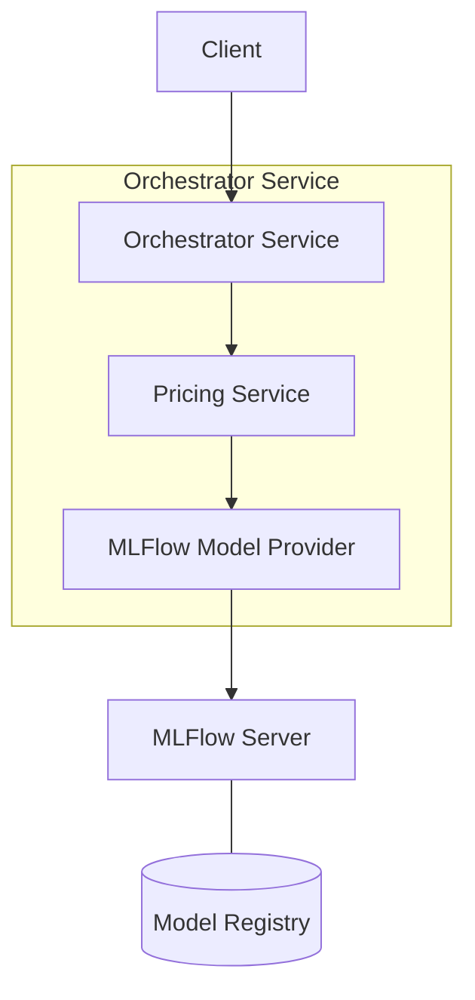

# Delve 23: Let's Build a Modern ML Microservice Application - Part 10, Improving DevX with AI


> "Code is read much more often than it is written." - Guido van Rossum

Greetings data delvers! It has been a while since we last delved into modern ML microservices. In [part nine](2025-12-07-ml-micro-part-nine.md) of this series we looked at optimizing our docker container setup. Since then, AI of course has become a much more prominent tool in the software engineering space. While there has been much commentary about how AI can lead to developer burnout for this delve I want to take a look at how AI can actually improve the developer experience!
<!-- more -->

## DevX

When starting a new project, the Developer Experience (or DevX) is usually not top of mind. The focus is on "ship it" without much thought into how the code will be maintained over time. This leads to many issues that negatively impact the experience of working with the code: poor documentation, cryptic build processes, technical debt, missing tests, etc. In the era of AI vibe coding, this problem can become even worse with the volume of code being produced. However, just as AI can be a tool to push slop, it can also be very useful in taming the very issues that come from it. Let's dive in and see how.

## The Setup

I'm starting with the [part nine](https://github.com/DataDelver/modern-ml-microservices/tree/part-nine) state of my Modern ML Microservices repo. While I hope this repo is pretty straightforward it has a few drawbacks:

* Lack of clear instructions of how to run the project - You have to remember all of the `uv` and `pytest` commands to fix everything
* No automated linting - While we have ruff available, we need to remember to run it
* Sparse Readme - Pretty self explanatory

This mirrors what I typically find neglected in most projects, since none of these issues are critical path to getting the software functional they are deprioritized. A perfect candidate for improvement with AI.

## Enter... the AI!

For this particular project I decided to use the Gemma4 quants available from [Unsloth](https://huggingface.co/unsloth/gemma-4-12b-it-GGUF), since this isn't a purely coding focused task I wanted a more general purpose model. My full setup script is available below:

```powershell title="Start-Gemma4.ps1" linenums="1"
<#
.SYNOPSIS
    Starts a highly optimized llama-server instance for Claude Code using Gemma 4 Q4_K_M.
.DESCRIPTION
    Allocates a 64K context window completely on your RTX 4090 (24GB VRAM),
    safeguards port 11434 from Ollama collisions, and enforces proper multi-line escaping.
#>

# 1. Port Safety Check (Ensure local Ollama isn't occupying the backend)
$PortToCheck = 11434
$ActivePort = Get-NetTCPConnection -LocalPort $PortToCheck -ErrorAction SilentlyContinue

if ($ActivePort) {
    Write-Warning "⚠️ Port $PortToCheck is already in use by another application (likely native Ollama)."
    Write-Warning "Please close Ollama from your Windows system tray before running this llama-server script."
    Read-Host "Press Enter to exit..."
    exit
}

# 2. Server Parameter Definitions
$RepoID = "unsloth/gemma-4-12b-it-GGUF"
$ModelFile = "gemma-4-12b-it-Q4_K_M.gguf"
$ModelAlias = "gemma4"
$ContextSize = 65536
$GPULayers = 99
$HostAddress = "0.0.0.0"

Write-Host "🚀 Launching Local Gemma 4 Engine (64K Context) on RTX 4090..." -ForegroundColor Cyan

# 3. Execution Block
llama-server `
    -hf $RepoID `
    -m $ModelFile `
    --alias $ModelAlias `
    --ctx-size $ContextSize `
    -ngl $GPULayers `
    -fa on `
    --cache-type-k q8_0 `
    --cache-type-v q4_0 `
    --jinja `
    --temp 1.0 `
    --top-p 0.95 `
    --top-k 64 `
    --spec-type draft-mtp `
    --spec-draft-n-max 2 `
    --host $HostAddress `
    --port $PortToCheck
```

If you want a full breakdown of how to use this script and connect it to Claude Code check out [the previous delve](2026-06-22-local-claude-redux.md)!

!!! note
    One of the benefits the unsloth quant provided was the ability to enable [Multi Token Prediction (MTP)](https://unsloth.ai/docs/models/mtp) with the `--spec-type draft-mtp` flag. This resulted in a pretty significant speed up in token generation for me.

## Just Do It!

Tackling the first problem of having to remember commands we can introduce [just](https://github.com/casey/just) as a command runner tool. Just is inspired by [make](https://www.gnu.org/software/make/) but designed specifically as a command runner, not a build tool meaning it can avoid some of the [complexities of the original make](https://github.com/casey/just#what-are-the-idiosyncrasies-of-make-that-just-avoids). I find it extremely useful to alias commands in projects so I don't have to remember all the syntax. For example, we can add a `justfile` to the root of our project with the following contents:

```justfile title="justfile" linenums="1"
# Lint code
lint:
    @echo "🔍 Linting code..."
    uv run ruff check .
```

And instead of having to remember the specific command to invoke ruff we can instead execute `just check` in our shell instead, pretty neat!

```bash
just lint
🔍 Linting code...
uv run ruff check .
All checks passed!
```

Now, we could write all of our command aliases by hand, but that would take a while, instead let's ask AI to do it!

!!! claude
    Create a justfile for this repo with standard commands such as installing or updating all packages, building workspace packages, spinning up and tearing down the docker containers, running tests (optionally with coverage or generating an html report), linting, lint fixing, formatting the code and running a format check. Include emoji echo outputs for each command.

You can iterate back and forth with Claude to configure it how you like it but I ended up with something like this:

```justfile title="justfile" linenums="1"
# Default command: List all available commands
default:
    @just --list

# Install all dependencies
install:
    @echo "📦 Installing dependencies..."
    uv sync

# Update all dependencies
update:
    @echo "🔄 Updating dependencies..."
    uv lock --upgrade

# Build workspace packages
build:
    @echo "🏗️ Building workspace packages..."
    uv sync --all-packages

# Spin up Docker containers
up:
    @echo "🚀 Spinning up Docker containers and attaching to logs..."
    docker compose up -d --build --remove-orphans && docker compose logs -f

# Tear down Docker containers
down:
    @echo "🛑 Tearing down Docker containers..."
    docker compose down

# Run tests
test:
    @echo "✅ Running tests..."
    uv run pytest

# Run tests with coverage
test-cov:
    @echo "📊 Running tests with coverage..."
    uv run pytest --cov=housing-price-orchestrator/src

# Run tests and generate HTML coverage report
test-html:
    @echo "🌐 Running tests and generating HTML coverage report..."
    uv run pytest --cov=housing-price-orchestrator/src --cov-report=html

# Lint code
lint:
    @echo "🔍 Linting code..."
    uv run ruff check .

# Lint and fix code
lint-fix:
    @echo "🔧 Linting and fixing code..."
    uv run ruff check . --fix

# Format code
format:
    @echo "✨ Formatting code..."
    uv run ruff format .

# Check formatting
format-check:
    @echo "🧐 Checking formatting..."
    uv run ruff format --check .

# Run tests, linting, and formatting check
check: lint format-check test pre-commit
    @echo "🎉 All checks passed!"

# Clean local build artifacts
clean:
    @echo "🧹 Cleaning local build artifacts..."
    find . -type d -name "__pycache__" -exec rm -rf {} +
    find . -type d -name ".pytest_cache" -exec rm -rf {} +
    find . -type d -name ".ruff_cache" -exec rm -rf {} +

# Clean Docker environment
clean-docker:
    @echo "🐳 Cleaning Docker environment..."
    docker compose down -v --remove-orphans
    docker system prune -f

# Clean everything
clean-all: clean clean-docker
    @echo "🗑️ Removing virtual environment..."
    rm -rf .venv
```

Now when I open a shell in my project and execute `just` I get a nice list of all the commands I have available to me!

```
just
Available recipes:
    build              # Build workspace packages
    check              # Run tests, linting, and formatting check
    clean              # Clean local build artifacts
    clean-all          # Clean everything
    clean-docker       # Clean Docker environment
    default            # Default command: List all available commands
    down               # Tear down Docker containers
    format             # Format code
    format-check       # Check formatting
    install            # Install all dependencies
    lint               # Lint code
    lint-fix           # Lint and fix code
    pre-commit
    pre-commit-install # Pre-commit hooks
    test               # Run tests
    test-cov           # Run tests with coverage
    test-html          # Run tests and generate HTML coverage report
    up                 # Spin up Docker containers
    update             # Update all dependencies
```

## Before you Commit to AI: pre-commit!

We now have a bunch of convenient commands for linting and fixing our code, but we still have to remember to run them before committing and pushing, lets fix that with [pre-commit](https://pre-commit.com/). 

Pre-commit does exactly what it sounds like, it executes a hook before `git commit` finishes running, let's ask Claude again to add this to our repo.

!!! claude
    Set up ruff with precommit https://github.com/astral-sh/ruff-pre-commit

!!! tip
    I often paste the url to docs straight into my prompts so Claude can reference them for me.

Doing this should generate something like the below output in the project root:

```yaml title=".pre-commit-config.yaml" linenums="1"
# Lint code
repos:
- repo: https://github.com/astral-sh/ruff-pre-commit
  # Ruff version.
  rev: v0.15.20
  hooks:
    # Run the linter.
    - id: ruff-check
      types_or: [ python, pyi ]
      args: [ --fix ]
    # Run the formatter.
    - id: ruff-format
      types_or: [ python, pyi ]
```

Now when we run `git commit` our code will be automatically linted and formatted for us!

!!! note
    This works for Claude as well so it's a good way to ensure any auto generated code is properly formatted too!

Pre-commit requires installation commands in order to use, lets ask Claude to add them to our justfile.

!!! claude
    Add commands to the justfile for running pre commit hooks, and installing pre commit

This generates something like this, great!

```justfile title="justfile" linenums="65"
# Pre-commit hooks
pre-commit-install:
    @echo "🔧 Installing pre-commit hooks..."
    pre-commit install

pre-commit:
    @echo "🚀 Running pre-commit hooks..."
    pre-commit run --all-files
```

## The Best Diagramming Tool for AI: Mermaid 🧜‍♀️

Currently there are no architecture diagrams in the repo to show how the different layers fit together, instead of drawing one by hand, let's ask Claude to use [Mermaid](https://docs.github.com/en/get-started/writing-on-github/working-with-advanced-formatting/creating-diagrams#creating-mermaid-diagrams) to create one for us. Mermaid has quickly become my go-to diagramming tool. It has a number of benefits mostly stemming from its markdown inspired syntax, allowing AI to easily write and *read* mermaid diagrams with its context. It also is natively rendered in VSCode and Github. Let's give it a try!

!!! claude
    In the main readme include a mermaid diagram the details the architecture of the project

This created the following Markdown in the project Readme:

````markdown

````

Which renders like so:


!!! tip
    This is a very simple example but I have found mermaid diagrams + AI to be extremely useful for both diagramming and *exploring* codebases. If you are confronted with a new codebase that you don't understand, ask Claude to generate a diagram of it!

## Let's Refactor

Now that we have some documentation in place, let's try out Claude for some refactoring work. The current way config values are loaded is somewhat confusing, they could come from the project `config.yaml` but they could also be overridden by environment variables, let's make this more explicit. Instead of loading config values directly from the environment, let's modify our config loader to only read them from `config.yaml` but explicitly allow overriding certain variables with a `${value:default}` syntax. This gives us more control over which environment variable can and cannot be set by environment variables with an optional default fallback. Importantly, this also makes `config.yaml` the single source of truth for all configuration settings.

Since this is a bit of a larger task lets use the `plan` mode in Claude to have it give us a plan document to approve rather than just jumping in.

!!! claude
    Create a plan to refactor the config loader to only read config values from the yaml file, however, the yaml should support defining parameters in the form of ${value:default} to load environment variables

This gave me the following plan:

??? abstract "Claude Plan"
    <h2>Objective</h2>
    Refactor the configuration loader in `housing-price-orchestrator` to exclusively read configuration values from the `config.yaml` file. To maintain flexibility, the YAML file will support a `${VAR_NAME:default_value}` syntax that dynamically resolves environment variables at runtime.

    <h2>Current State</h2>
    - The `Config` class in `src/shared/config/config_loader.py` currently uses `pydantic_settings` with multiple sources: `init_settings`, `env_settings`, `dotenv_settings`, `file_secret_settings`, and `YamlConfigSettingsSource`.
    - This means Pydantic automatically attempts to populate fields from environment variables and `.env` files, bypassing the YAML file for those values.

    <h2>Proposed Changes</h2>

    <h3>1. Restrict Configuration Sources</h3>
    Modify the `Config` class in `src/shared/config/config_loader.py` to stop automatically loading environment variables.
    - **Action**: Update `settings_customise_sources` to remove `env_settings` and `dotenv_settings`.
    - **Result**: Pydantic will now only populate the configuration fields from the YAML file (via `YamlConfigSettingsSource`) and secrets, effectively making the YAML the primary source of truth.

    <h3>2. Implement Environment Variable Resolution via <code>model_validator</code></h3>
    Add a `model_validator` to the `Settings` class to dynamically parse and resolve the `${VAR:default}` syntax before Pydantic performs its internal validation.
    - **Action**: Define a `@model_validator(mode='before')` on the `Settings` class.
    - **Logic**:
        - The validator will receive the raw dictionary of values parsed from the YAML.
        - It will recursively traverse the dictionary to find any string values.
        - It will use a regular expression to identify strings matching the `${VARIABLE_NAME:default_value}` pattern.
        - It will replace these strings with the actual environment variable value (falling back to the provided default if the environment variable is missing).
    - **Benefit**: This approach keeps the configuration logic clean and separates the "loading" of data (YAML) from the "resolution" of dynamic values (Environment variables).

    <h3>3. Define Parsing Logic</h3>
    Within the validator, the following logic will be implemented:
    - **Regex**: Use `r"\$\{([^:]+)(?::([^}]+))?\}"` to capture the variable name and the optional default.
    - **Resolution**: Use `os.getenv(var_name, default_value)` to retrieve the final value.
    - **Recursion**: Ensure that if the YAML contains nested dictionaries or lists, the validator still reaches and resolves placeholders inside them.

    <h3>4. Update <code>config.yaml</code></h3>
    Update the `config.yaml` file to demonstrate the new interpolation syntax.
    - **Example**: `pricing_model_url: ${MODEL_URL:http://default:8080}`.

    <h3>5. Verification and Testing</h3>
    - **Unit Tests**: Create new tests in `tests/unit/` to verify:
        - **Literal values**: Ensure strings without `${}` are not modified.
        - **Interpolation**: Verify that a value like `${DB_URL:localhost}` correctly picks up `DB_URL` from `os.environ`.
        - **Default Fallback**: Verify that if `DB_URL` is missing, the value falls back to `localhost`.
        - **Nested Resolution**: Ensure placeholders inside nested YAML structures are correctly resolved.

    <h2>Implementation Steps</h2>
    1. Modify `src/shared/config/config_loader.py` to remove automatic environment settings and add the `model_validator` to the `Settings` class.
    2. Update `src/shared/config/config.yaml` to use the new `${VAR:default}` syntax for dynamic values.
    3. Run the unit tests to ensure the refactoring works as expected.
    4. Run `just lint` to ensure code quality standards are met.

Notice how Claude is now planing to take advantage of our `just` commands to ensure that the linting is correct? Our tooling doesn't just help us, it helps Claude as well! After approving this plan it took a bit of back and forth with Claude but let's look at the changes that were ultimately made.

### Config File Changes

Our config file will just need a simple change to follow the new syntax to enable the explicit env var override:

```yaml title="housing-price-orchestrator/src/shared/config/config.yaml" linenums="1" hl_lines="2 13 14"
default: &default
  pricing_model_url: ${MODEL_URL:http://housing-price-model:8080}

dev:
  <<: *default

qa:
  <<: *default

prod:
  <<: *default

local:
  <<: *default
```

!!! Note
    I also added a `local` environment specifically for local configuration.

### Config Loader Changes

The biggest set of changes took place in the config loader.

Firstly we are going to need a few more imports:

```python title="housing-price-orchestrator/src/shared/config/config_loader.py" linenums="1" hl_lines="3-6"
from functools import lru_cache
import pathlib
import os
import re
from typing import Tuple, Type, Any
from pydantic import BaseModel, model_validator
from pydantic_settings import (
    BaseSettings,
    PydanticBaseSettingsSource,
    SettingsConfigDict,
    YamlConfigSettingsSource,
)
```

Next, Claude generated a recursive environment variables resolver function for us:

```python title="housing-price-orchestrator/src/shared/config/config_loader.py" linenums="15" 
def resolve_env_vars(data: Any) -> Any:
    """Recursively resolves environment variable placeholders in the provided data.

    It identifies placeholders in the format ${VAR_NAME:default_value} or ${VAR_NAME}
    and replaces them with the corresponding environment variable value or the
    provided default value.

    Args:
        data: The data structure (dict, list, or string) containing potential
            placeholders to resolve.

    Returns:
        The data with all environment variable placeholders resolved.
    """
    if isinstance(data, dict):
        return {k: resolve_env_vars(v) for k, v in data.items()}
    elif isinstance(data, list):
        return [resolve_env_vars(item) for item in data]
    elif isinstance(data, str):
        # Matches ${VAR_NAME} or ${VAR_NAME:default_value}
        pattern = r"\$\{([^:]+)(?::([^}]+))?\}"

        def replace_match(match: re.Match) -> str:
            var_name = match.group(1)
            default_value = match.group(2)

            if default_value is not None:
                return os.getenv(var_name, default_value)
            else:
                val = os.getenv(var_name)
                return val if val is not None else ""

        return re.sub(pattern, replace_match, data)
    return data
```

Next we can use a trick with [Pydantic Model Validators](https://pydantic.dev/docs/validation/latest/concepts/validators/#model-validators) to execute this function *before* Pydantic validates the field:

```python title="housing-price-orchestrator/src/shared/config/config_loader.py" linenums="51" hl_lines="4-9"
class Settings(BaseModel):
    pricing_model_url: str

    @model_validator(mode="before")
    @classmethod
    def resolve_env_vars_validator(cls, data: Any) -> Any:
        if isinstance(data, dict):
            return resolve_env_vars(data)
        return data
```

Lastly we need to modify our config base class to prevent it from loading values from environment variables directly (and to add our new local environment).

```python title="housing-price-orchestrator/src/shared/config/config_loader.py" linenums="62" hl_lines="6 21-23"
class Config(BaseSettings):
    default: Settings
    dev: Settings
    qa: Settings
    prod: Settings
    local: Settings
    model_config = SettingsConfigDict(
        yaml_file=pathlib.Path(__file__).parent.resolve() / "config.yaml"
    )

    @classmethod
    def settings_customise_sources(
        cls,
        settings_cls: Type[BaseSettings],
        init_settings: PydanticBaseSettingsSource,
        env_settings: PydanticBaseSettingsSource,
        dotenv_settings: PydanticBaseSettingsSource,
        file_secret_settings: PydanticBaseSettingsSource,
    ) -> Tuple[PydanticBaseSettingsSource, ...]:
        return (
            init_settings,
            file_secret_settings,
            YamlConfigSettingsSource(settings_cls),
        )
```

### Config Tests

As part of its plan Claude will generate unit tests for our new loader behavior as well (ensuring we have good test coverage of this new behavior from the beginning):

```python title="housing-price-orchestrator/tests/unit/config/test_config_loader.py" linenums="1"
import os
import pytest
from unittest.mock import patch
from shared.config.config_loader import load_config_settings


@pytest.fixture(autouse=True)
def clear_config_cache():
    """Clear the config loader cache before each test."""
    load_config_settings.cache_clear()
    yield


def test_config_default_values():
    """Test that configuration loads correctly from YAML with no environment variables set."""
    # GIVEN
    # Ensure MODEL_URL is not set
    with patch.dict(os.environ, {}, clear=True):
        # WHEN
        config = load_config_settings("default")

        # THEN
        assert config.pricing_model_url == "http://housing-price-model:8080"


def test_config_with_env_var():
    """Test that configuration loads correctly from YAML with environment variables set."""
    # GIVEN
    with patch.dict(os.environ, {"MODEL_URL": "http://custom-model:9000"}):
        # WHEN
        config = load_config_settings("default")

        # THEN
        assert config.pricing_model_url == "http://custom-model:9000"


def test_config_environments():
    """Test that different environments (dev, qa, prod) load correctly."""
    # GIVEN
    with patch.dict(os.environ, {"MODEL_URL": "http://custom-model:9000"}):
        # WHEN
        dev_config = load_config_settings("dev")
        qa_config = load_config_settings("qa")
        prod_config = load_config_settings("prod")

        # THEN
        assert dev_config.pricing_model_url == "http://custom-model:9000"
        assert qa_config.pricing_model_url == "http://custom-model:9000"
        assert prod_config.pricing_model_url == "http://custom-model:9000"


def test_config_fallback_to_default():
    """Test that configuration falls back to the default value provided in the ${VAR:default} syntax."""
    # GIVEN
    # We want to verify that if MODEL_URL is missing, it uses the default.
    # In config.yaml, the default is http://housing-price-model:8080.
    # We can't easily change the YAML for one test, but we can check that
    # when MODEL_URL is NOT in env, it returns the YAML's default.
    with patch.dict(os.environ, {}, clear=True):
        # WHEN
        config = load_config_settings("default")

        # THEN
        assert config.pricing_model_url == "http://housing-price-model:8080"
```

With AI there's no excuse not to have unit tests!

!!! tip
    After these tests are written, prompt Claude to run them (if it doesn't already) to ensure they all pass, if they don't Claude will then debug the tests and figure out why.

### Local Environment Wrap Up

In order to use our new local environment we need to final small changes.

Create an `.env` file in the project root with the following contents (this could be a good place to put local secret values as well in the future):

``` title=".env" linenums="1"
ENV=local
```

And update our docker compose to use this variable:

```yaml title="compose.yaml" linenums="1" hl_lines="16"
services:
  housing-price-model:
    build:
      context: housing-price-model/build
      dockerfile: Dockerfile
    ports:
      - "8080:8080"
      - "8081:8081"
      - "8082:8082"
  housing-price-orchestrator:
    build: 
      context: housing-price-orchestrator
      additional_contexts:
        project_root: .
    environment:
      - ENV=${ENV}
    ports:
      - "8000:8000"
    depends_on:
      - housing-price-model
```

Refactor complete!

## Dr Claude

While doing this refactor I had to prompt Claude a few times to make sure it followed the conventions of the repo, a good way to enforce this going forward is to create a `CLAUDE.md` file in the project root. This will get injected every time we run Claude so it's best to keep this file small to preserve our context.

Instead of writing this file ourselves...

!!! claude
    Add a CLAUDE.MD file documenting this project including the build and test just commands available, the architecture and directory layout, main repo conventions, and testing standards.

Which created the following:

```markdown title="Claude.md" linenums="1"
# Project Overview
A microservices architecture for orchestrating housing price regression models.

## Build and Test Commands
These commands are available via `just`:

- `just install`: Install all dependencies using `uv sync`.
- `just update`: Update all dependencies using `uv lock --upgrade`.
- `just build`: Build workspace packages.
- `just up`: Spin up Docker containers and attach to logs.
- `just down`: Tear down Docker containers.
- `just test`: Run unit and integration tests using `pytest`.
- `just test-cov`: Run tests with coverage.
- `just test-html`: Run tests and generate an HTML coverage report.
- `just lint`: Run `ruff` check.
- `just lint-fix`: Run `ruff` check and fix issues.
- `just format`: Format code using `ruff` format.
- `just format-check`: Check if the code follows formatting rules.
- `just pre-commit-install`: Install pre-commit hooks.
- `just pre-commit`: Run all pre-commit hooks.
- `just check`: Run linting, formatting check, tests, and pre-commit hooks.

## Architecture and Directory Layout
The project is organized into several main components:

- `housing-price-orchestrator/`: The core service for orchestrating price predictions.
    - `src/provider`: Handles interaction with MLFlow model providers.
    - `src/service`: Contains the primary business logic for pricing services.
    - `src/shared`: Common code shared across the orchestrator, including:
        - `config`: Configuration loading and management.
        - `dto`: Data Transfer Objects.
        - `view`: Request/Response views.
    - `tests`: Unit and integration tests for the orchestrator service.
- `housing-price-model/`: Contains the logic for building and serving the ML model.
- `mlflow-server/`: Infrastructure for serving the MLFlow model.

## Main Repository Conventions
- **Language**: Python 3.13+
- **Tooling**: `uv` for package management, `pydantic` for data validation, `ruff` for linting and formatting.
- **Docstrings**: Use Google-style docstrings for functions and classes.
- **Configuration**: Use `config.yaml` for environment-specific settings, supporting `${VAR_NAME:default}` syntax for environment variable interpolation.
- **Typing**: Mandatory type hints for all function signatures and variable definitions.

## Testing Standards
- **Unit Tests**: Located in `tests/unit/`.
- **Integration Tests**: Located in `tests/integration/`.
- **Pattern**: Follow the `GIVEN / WHEN / THEN` structure for test cases.
- **Mocking**: Use `pytest-mock` for isolating dependencies.
- **Coverage**: Maintain high coverage as verified by `just test-cov`.
```

## Wrapping it Up

Hopefully this delve has shown just how useful AI can be to improve the developer experience and do some refactoring along the way!

## Delve Data
* There are a number of optimizations described in the `uv` documentation for Docker image builds.
* Using multi-stage Docker builds, we can support additional build-time dependencies while ensuring they don't increase the size of the overall image.
